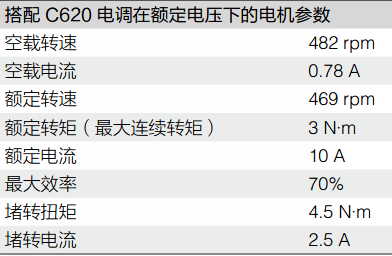
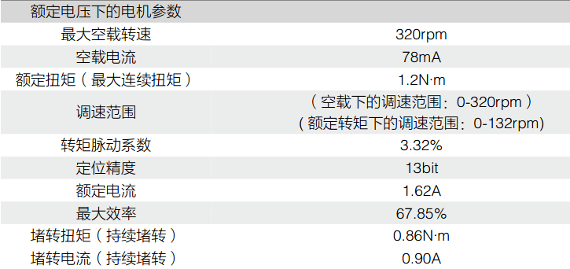
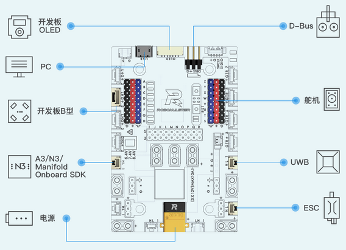
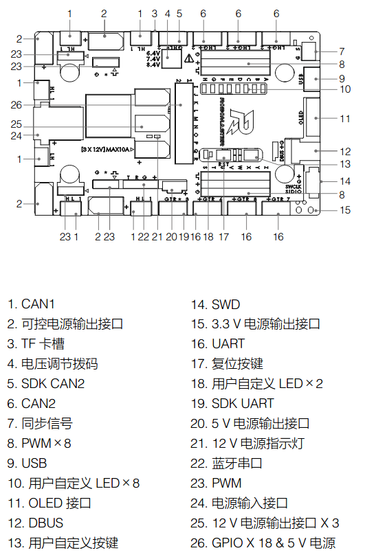
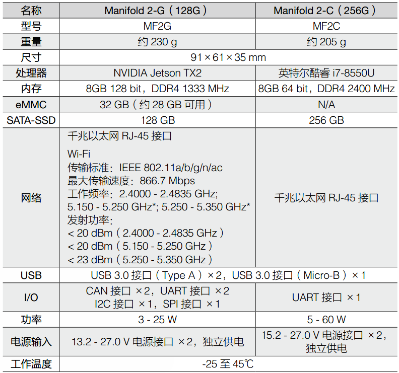
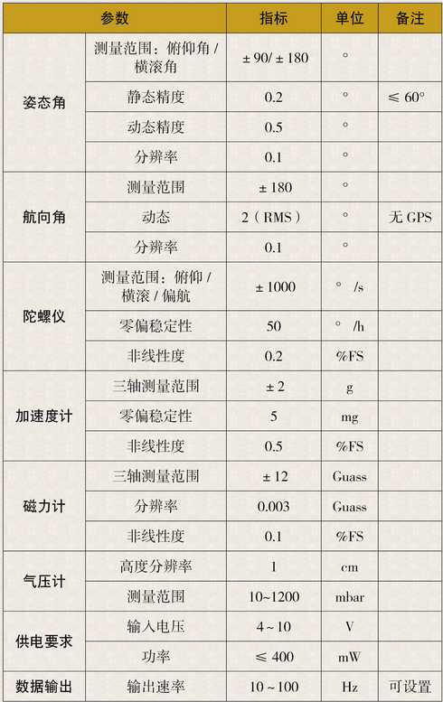
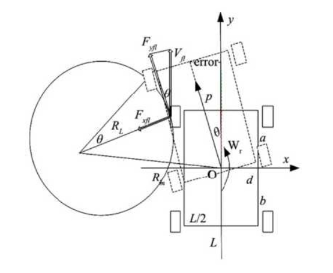
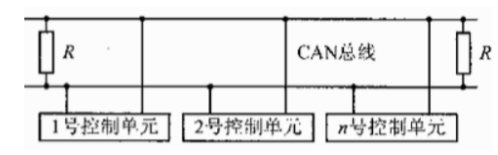

# 四轮巡视探测越障平台控制系统设计

## 摘要

当前的机器人技术是世界的主流尖端科技.各式各样的机器人也逐步走入各行各业的各个领域.例如机器人既是先进制造业的关键装备,也是改善人类生活方式的重要载体.在灾害救援过程中也起到了不可替代的作用.其研发及产业化应用也是衡量一个国家科技创新,高端制造发展水准的重要标准.

在本次毕业设计中,我需要设计一台四轮驱动的机器人的智能控制系统,该机器人涉及控制理论,传感器技术,计算机科学和人工智能等多门学科.本文对四轮巡视探测机器人的研究重点包括三个方面:

* 1.四轮巡视探测机器人的硬件平台设计
* 2.四轮巡视探测机器人的软件平台设计
* 3.四轮巡视探测机器人的导航系统设计

本论文综述了移动机器人在城市灾害救援中的研究和应用现状以及机器人的关键技术,给出了该四轮巡视探测机器人的硬件平台和基于该平台的运动控制设计.首先本文对机器人的相关硬件进行了分析,然后结合机器人的机械结构进行了运动控制研究,提出了基于串级PID的云台系统设计,以及IMU传感器的巴特沃斯滤波算法设计.最后对四轮巡视探测机器人的导航系统做了研究,提出了基于ROS(Robot Operating System)的导航系统设计,通过里程计,IMU,激光雷达等传感器进行即时SLAM(即时定位与地图构建),使用摄像头获取图像信息进行视觉检测和跟踪.

关键词: 运动控制,串级PID,巴特沃斯滤波,ROS,SLAM,视觉检测


## Abstract

The current robot technology is the world's mainstream cutting-edge technology. Various kinds of robots are gradually into all walks of life in all fields. For example, robots are not only the key equipment of advanced manufacturing industry, but also an important carrier to improve the human way of life. In the process of disaster relief also played an irreplaceable role. Its research and development and industrialization application is also an important standard to measure a country's scientific and technological innovation, high-end manufacturing development standards.

In this graduation design, I need to design an intelligent control system for a four-wheel-drive robot involving control theory, sensor technology, computer science and artificial intelligence:

* 1.Hardware platform design of four-wheel inspection detection robot
* 2.Software platform design of four-wheel inspection detection robot
* 3.Navigation system design of four-wheel inspection detection robot

This paper summarizes the research and application status of mobile robot in urban disaster rescue and the key technology of robot, gives the hardware platform of the four-wheel patrol detection robot and the motion control design based on the platform. First, the relevant hardware of the robot is analyzed, and then the motion control research is carried out in combination with the robot's mechanical structure, and the design of the cloud platform system based on serial PID is proposed. As well as the Butterworth filtering algorithm design of IMU sensors. Finally, the navigation system of the four-wheel edging detection robot is studied, and the navigation system design based on THE ROS (Robot Operating System) is proposed, which is carried out instantly by THE odometer, IMU, lidar and other sensors for SLAM instant (instant positioning and map construction), and the use of camera to obtain image information for visual detection and tracking.

Key Words: Motion Control, String PID, Butterworth Filter, ROS, SLAM, Visual Detection

## 第1章 绪论

### 1.1 引言

### 1.2 课题研究目的与意义

在城市灾害救援环境下，经常存在灾害搜救的二次灾害，例如在受到大地震影响的城市中，常会发生多次余震，给搜救人员带来危险，甚至受害者还没有救出来，搜救队员就遭遇危险。再如最近的新冠状病毒引发的肺炎疫情出现以来，众多医护人员奋战在前线，他们不仅要面对成千上万的患者，还要防备传染性极强的冠状病毒。很不幸的是，自2020年2月17日所统计的数据来看目前已有3019名医务人员感染新冠病毒，毫无疑问，感染人数将在未来不断升高。这冰冷的数字后面是一个个活生生的生命，家庭，我不禁为此感到痛心疾首。我们所要做的，就是给奋战在前线的救援者提供帮助，作为一种可以替代人工作业的机器人，便可以在各种恶劣环境下帮助救援人员深入危险之地进行救援操作。

### 1.3 国内外机器人研究现状

由于机器人具备灵活性强，不怕有毒有害气体，对人体有害的病毒，抗疲劳性强，可以长时间不间断的进行作业等特点，可以深入到危险环境里实现救援等任务，保障救援人员的生命安全。因此国内外逐渐意识到机器人在灾难事故救援中的意义。

美国JPL(Jet Propulsion Laboratory,喷气推进实验室)实验室在地理勘测，海洋开发等方面具有很强的优势，并与NASA进行深入合作，开展自主式移动机器人的研究。来验证行星探测车的可行性。目前该实验室已经研究出多种探测车，如2004年登入火星上的“勇气号”漫游车。美国“机器人辅助搜救中心”（Center for Robotic Assisted Search and Rescue,CRASAR）在“911”事件发生后的几个小时内组织了一批机器人技术专家和生产厂家技术人员，携带可以使用的机器人赶到灾难现场展开救援行动。据相关报道,搜救机器人的效率是现场的搜救人员的一倍，并且还降低了搜救过程中的风险。

目前国内部分机器人公司和高效也开展了机器人的研究，由于国内机器人研究相对较晚，进展较慢。但是国内的一些科研机构还是推出了自己的机器人。如哈尔滨工业大学和清华大学的灭火机器人，优必选公司研发的ATRIS安巡士智能巡检机器人，擎郎智能研发的医疗配送机器人。尤其是擎郎智能研发的机器人在这次新冠病毒的疫情中发挥了重要作用，自疫情爆发以来，擎郎智能为全国各地的医院，定点隔离区驰援送餐机器人。工作人员只需要在三餐时间将食物放在机器人的托盘上，在触摸屏输入隔离区的房间号，机器人就能自动追踪房间号将餐食送达，从而有效减少了人员交叉感染，提升了防控能力。

### 1.4 本课题的研究内容与章节安排

在城市灾害救援环境下，常存在灾害搜救的二次伤害，需要借助轮式平台搭载载荷和搜救装置进入，减少人员进入的危险。本课题旨在研制一种摇臂悬架式小型四轮越障平台以代替人工搜救，提高搜救效率，减少二次伤害。

本学位论文研究的主要内容如下:

* 第一章 综述了国内外移动机器人研究和应用现状,阐述来本毕业设计研究目的与意义以及主要研究内容.
* 第二章 设计了四轮巡视探测机器人的硬件体系,并对机器人的电机,计算设备和传感器进行了分析.
* 第三章 设计了四轮巡视探测机器人的软件框架,建立了机器人的运动学模型,并提出了一种基于串级PID的云台系统控制方案以及IMU传感器的滤波算法.
* 第四章 设计了四轮巡视探测机器人的导航系统,此系统基于ROS(Robot Operating System)操作系统,并分析了此系统所使用的定位算法和导航算法,其中导航算法又分为局部导航和全局导航,最后对视觉检测和视觉跟踪算法进行了分析和实践.
* 第五章 对论文所做的工作进行来总结并对今后的工作作出来展望.

## 第2章 四轮巡视探测机器人硬件平台设计

### 2.1 引言

根据毕业设计的要求,我希望设计的移动机器人能够满足如下要求:

* 能够通过遥控器或电脑进行远程控制;
* 能够在未知环境下进行实时定位与建图,同时可以局部路径规划和全局路径规划;
* 能够离线执行各种复杂的探测任务,例如实时运行yolov3等神经网络算法;

按照以上要求，根据实验室现有的移动机器人结构，我们挑选了相关传感器和运算设备，设计了一款可全自动化运行的移动机器人的硬件体系，该机器人采用四轮结构，可全向移动，目前能够满足我们的试验要求。

### 2.2 硬件通信链路设计

该机器人的嵌入式硬件电路系统如下图所示：


该机器人的底盘和云台两部分都配置了RoboMasterA型开发板，两块开发板之间，底盘电机和底盘控制板，云台电机和云台开发板都是通过can总线进行数据传输，CAN总线与其他总线相比，CAN总线通信最高速率可达1Mbps，并且数据传输可靠性高，电路结构简单；妙算与底盘控制板通过USB进行通信，激光雷达，工业相机和高精度IMU通过USB串口与妙算进行通讯。该机器人通过WIFI与第三方设备进行通信。

### 2.3 电机选型

#### 2.3.1 底盘电机分析

该机器人所使用的底盘电机为M3508直流无刷减速电机，是一款专为机器人量身打造的高性能伺服电机，可搭配RoboMaster C620电调实现正弦驱动，相比传统方波驱动具有更高的效率，机动性和稳定性。本产品的减速箱减速比约为19:1。产品特性如下：

* 位置反馈：电机自带位置传感器，可提供位置的反馈。
* 温度检测：电机自带温度检测传感器，可有效防止电机因温度异常被损坏。
* 信息存储：存储电机校准参数，支持电机的快速更换。



#### 2.3.2 云台电机分析

该机器人所使用的云台电机型号为GM6020,它是一款内部集成驱动器的高可靠性直流无刷电机。高极数设计，稀土材料磁铁及分数槽集中绕组方式确保电机输出更大的扭矩，可为低转速，大扭矩直接驱动应用提供高性能的解决方案。驱动器采用磁场定向控制(FOC)算法，配合高精度的角度传感器，能实现精确的力矩和位置控制。该电机具有如下产品特性：

* 空心轴结构，用户可根据需求安装滑环配件
* 电机和驱动器一体化设计，结构紧凑，集成度高
* 支持多种通讯方式(CAN，ＰＷＭ)
* 支持使用RoboMaster Assisstant软件进行在线调参和升级
* 通过CAN总线可以获取转子位置，转子速度，电机温度等信息
* 支持通过拨码开关设置ID和选通CAN终端电阻
* 具有过温和过压保护等功能



### 2.4 计算设备分析

#### 2.4.1 嵌入式控制板分析

该机器人所使用的嵌入式开发板为RoboMasterA型开发板，主控芯片为STM32F427IIH6,拥有丰富的扩展接口和通信接口，包括12V\5V\3.3V电源接口、CAN接口、UART接口、可变电压PWM接口、SWD接口等。



RoboMasterA型开发板可使用4S-6S锂电池。可以连接舵机、遥控器接收机、妙算、单轴陀螺仪、电子调速器、蓝牙模块、PC、OLED等多种配件。



#### 2.4.2 机载电脑分析

该机器人所使用的机载电脑为妙算２(Manifold 2-G(128G))进行算法实现，该设备的性能参数如下图所示：



由于我们的机器人需要解决定位和导航问题，需要实时获取和处理激光雷达数据和大量图像数据，还要运行深度神经网络算法，如yolov3算法对目标物体进行检测和识别，并且机器人上需要装载许多传感器等硬件，空间有限，所以我需要一台计算能力强，体型小巧的计算平台，妙算２符合上述要求。

### 2.5 传感器选型和用途

#### 2.5.1 激光雷达分析

激光雷达是一款比较昂贵的传感器，由于我们的试验场地是在室内环境下进行的，所以我选择的是思岚A3激光雷达，价格适中。室内环境下，在白色物体下最大测量距离为25m，测量盲区为0.2m，采样频率为16KHz,角度分辨率为0.225°，扫描频率最大可达15HZ。我们的测试环境长宽都远小于25ｍ，可以使用。在面对不同的使用场景时，我们可以根据参数来更换合适的激光雷达，在本次毕业设计中我们仅需要验证算法即可。

#### 2.5.2 视觉摄像头分析

该机器人所使用的为SKT-CL130C-127AA1-V1工业相机。相机内置１/2.7英寸CMOS图像传感器，最大分辨率支持1280*1024,在130W像素下帧率可达120fps。所选镜头焦距有可变焦和定焦镜头，分别应用于不同场景。

#### 2.5.3 高精度IMU分析

高精度IMU的主要作用是获取机器人的航向角信息，来修正机器人的姿态，我所选用的传感器为三驰惯性SC-AHRS-100D2高精度IMU，由惯性测量单元、磁传感器构成。产品内部嵌入扩展卡尔曼滤波算法，提供精确的磁航向、姿态角等角度信息。性能指标如下图所示：



## 第3章 四轮巡视探测机器人软件平台设计

机器人的硬件系统和软件系统共同构建了一个可以由人来操控的平台，该平台可以进行感知，决策，运动规划，本章将对机器人的软件方案进行分析和设计，从机器人的底盘控制，陀螺仪姿态结算，云台控制三个方向展开讨论，并结合上一章的硬件体系结构，提出姿态结算和云台控制的具体实现方法。

### 3.2 问题分析和描述

移动机器人想要

### 3.3 移动机器人运动控制技术

移动机器人的运动控制就是通过调节机器人的运动速度和运动方向，使机器人沿期望的轨迹进行运动。本次毕业设计所采用的为四轮独立驱动，该结构特点是将四个独立驱动电机安装在每个车轮上，通过控制这四个电机的速度从而控制四个车轮的转速和转矩，实现机器人的转向运动，通过四轮独立驱动的特点，可使所有车轮均绕同一瞬时旋转中心转向，实现不同转向半径转向甚至原地零半径转向。

#### 3.3.1 移动机器人的运动学模型

##### 3.3.1.1转向运动学分析

四轮独立驱动转向运动学和动力学模型，如下图所示



上图所示，四轮移动机器人的左右两轮轮距为Ｌ，前后轮距为d。其中虚线所构成的直角三角形，斜边即为标示的中线Ｍiddle~set~，长的直角边即为检测到的中线Middle~tset~，偏差*error*即为短直角边，也就是检测到的中线与标示的中线差值。

由此可知：
$$
\theta=\arctan error/(p+d/2)\quad\quad\quad\quad(1)
$$
式中，$\theta$为转向角。***p***为CCD视角的前瞻长度。

４个车轮转向角分别为$\theta$~fl~，$\theta$~fr~，$\theta$~rl~，$\theta$~rr~由上图显然可以得到 $\theta$~fl~$=\theta$~fr~$=\theta $~rl~$=\theta$~rr~$=\theta$，$\theta$~fl~（$\theta$~fr~，$\theta$~rl~，$\theta$~rr~)分别为左前轮（右前轮，左后轮，右后轮）的转向角。那么四个车轮对应的转向圆转过的角度的角速度 $\omega$~fl~= $\omega$~fr~= $\omega$~rl~= $\omega$~rr~$=\theta$。由于四个车轮的运动学分析是一样的，所以这里仅讨论左前轮的运动学。其中***V***~fl~为左前轮的合力提供的速度，***V***~y~为左前轮的实时圆轨迹的向心力提供的速度，***V~x~***为克服摩擦力提供的速度。四轮移动机器人的实时速度即为合力所提供的速度，并且实时速度可以通过速度编码器获得，假定实时速度为***V~r~***，那么可以得到：
$$
V_r=\omega R_m=\theta R_m\quad\quad\quad\quad(2)
$$

$$
R_m=R_L+L/2\quad\quad\quad\quad(3)
$$

式中：

* R~m~为四轮驱动模型的圆轨迹半径

* R~L~为左前轮圆轨迹的半径
* Ｌ为左右轮距

由式(1)，(2)，(3)可得
$$
R_m=V_r/\theta=V_r/\arctan(error/(p+d/2))
$$

$$
R_L=V_r/\arctan(error/(p+d/2))-L/2
$$

由此可得左前轮的向心力提供的向心速度：
$$
V_y=V_r-L\arctan(error/(p+d/2))/2\quad\quad\quad\quad(4)
$$
根据速度的合成，即可通过式(4)向心速度求出左前车轮的合成速度：

V~fl~$=V_y/\cos\theta=(V_y-L\arctan(error/(p+d/2))/2)/\cos(\arctan(p+d/2))$

且由左后轮的圆轨迹半径为R~bl~可知左后轮的合成速度：

V~rl~$=\sqrt{(V_r/\arctan(error/(p+d/2))-L/2)^2+(D/2)^2}$

V~rl~$=\arctan(error/(p+d/2))\cdot\sqrt{(V_r/error/(p+d/2)-L/2)^2+(d/2)^2}(5)$

V~fl~，V~rl~，可同理求出。

##### 3.3.1.2转向动力学分析

机器人模型的转动轴方向包括纵向，横向，垂直平移运动和绕３个垂直轴线的转动。当分析四轮巡视探测机器人时，忽略车辆行驶过程中汽车的pitch,roll,垂直平动，固定车辆的运动坐标原点与四轮巡视探测机器人质心重合。由图可知：

横向运动方程：
$$
F_{yfl}\sin\theta_{fl}+F_{xfl}\cos\theta_{fl}+F_{yfr}\sin\theta_{fr}+
F_{xfr}\cos\theta_{fr}+F_{yrl}\sin\theta_{rl}+F_{xrl}\cos\theta_{rl}+F_{yrr}\sin\theta_{rr}+F_{xrr}\cos\theta_{rr}=m\dot{v}\sin\theta
$$
纵向运动方程：
$$
Ｆ_{yfl}\cos\theta_{fl}-F_{xfl}\sin\theta_{fl}+F_{yfr}\cos\theta_{fr}-F_{xfr}\sin\theta_{fr}+F_{yrl}\cos\theta_{rl}-F_{xrl}\sin\theta_{rl}+F_{yrr}\cos\theta_{rr}-F_{xrr}\sin\theta_{rr}=m\dot{v}\cos\theta
$$
横摆运动方程：
$$
a(F_{xfl}\sin\theta_{fl}+F_{xfl}\cos\theta_{fl})-b(F_{yrl}\sin\theta_{rl}+F_{xrl}\cos\theta_{rl})+a(F_{yfr}\sin\theta_{fr}+F_{xfr}\cos\theta_{fr})-b(F_{yrr}\sin\theta_{rr}+F_{xrr}\cos\theta_{rr})=J\ddot{\varphi}
$$
式中，$J$为车体的转动惯量；$m$为车体的质量，$a,b$分别为车体重心距前后轮轴线的距离；$\theta$为侧偏角；$\varphi$为横摆角；$w_r=\ddot{\varphi}$为横摆角速度。$F_{xfl},F_{xfr},F_{xrl},F_{xrr}$,分别为前左，前右，后左，后右车轮上的纵向力；$F_{yfl},F_{yfr},F_{yrl},F_{yrr}$分别为前左，前右，后左，后右车轮上的横向力

#### 3.3.2 移动机器人的控制基础

##### 3.3.2.1 CAN协议简介

CAN是控制器域网(Controller Area Network,CAN)的简称，是由研发和生产汽车电子产品著称的德国BOACH公司开发，并最终成为国际标准(ISO11898)，CAN是国际上应用最广泛的现场总线之一。在北美和西欧，CAN总线协议已经成为汽车计算机控制系统和嵌入式工业控制局域网的标准总线，，并且拥有以CAN为底层协议专为大型货车和重工机械车辆设计的J1939协议。

CAN总线由CAN_H和CAN_L两根线构成，各个设备一起挂载在总线上。



在本次毕业设计所使用的云台电机和底盘电机均采用CAN协议进行通讯，CAN协议比较复杂，一个完整的数据帧由下图中的各个部分组成：


本文重点介绍CAN的仲裁场和数据场的内容。和I2C总线一样，每一个挂载在CAN总线上的CAN都有一个独有的ID，每当一个设备发送一帧数据时，总线其他设备会检查这个ID是否是自己需要接收数据的对象，如果是则接收本帧数据，如果不是则忽略。

ID存储在数据帧最前头的仲裁场，CAN的ID分为标准ID和拓展ID两类，标准ID长度为11位，如果设备过多，标准ID不够用的情况下，可以使用拓展ID，拓展ID的长度由２９位。


在通过ID判断本帧数据可以接收后，控制场中的DLC规定了本帧数据的长度，而数据场内的数据大小为8Byte，即8个8位数据。CAN总线的一个数据帧中所需要传输的有效数据实际上就是这8Byte。


##### 3.3.2.2 电机使用

在本次毕业设计中，我所使用了两款型号的电机，一款是应用于底盘的步科的MD系列集成式低压伺服电机，另一款是应用于云台的RM6020电机。

在本章节中我们将以RM6020电机为研究对象进行说明，我从RM官网下载到该电机的数据手册，并在数据手册中查找和CAN通讯有关的内容，可以找到如下内容：


这是电机中的电调接收报文的格式，即如果要发送数据给１号到４号电调，控制电机输出的电流，从而控制电机转速时，需要按照表中的内容，将发送的CAN数据帧的ID设置为`0x1FF`，数据域中的8Byte数据按照电调１到４的高八位和低八位的顺序装填，帧格式和DLC也按照表中内容进行设置，最后进行数据的发送。

当腰接收电机中的电调发送来的数据时，则按照下表进行：


首先根据接收到的ID判断究竟接收到的是哪个电调发送来的数据，手册中规定１号电调ID为`0x205`，２号电调为`0x206`，３号电调为`0x207`，４号电调为`0x208`，判断完数据来源之后，就可以按照手册中的数据格式进行解码，通过高八位和低八位拼接的方式，得到电机的转子机械角度，转子转速，实际转矩电流，电机温度。

##### 3.3.2.3 CAN发送函数介绍

在本小节中，我将介绍CAN的发送函数，分别为 `CAN_cmd_chassis `函数和 `CAN_cmd_chassis` 函数，用于向底盘电机和云台电机发送CAN信号，控制电机运动，这是让电机运动的基本核心代码。

`CAN_cmd_chassis `函数的输入为电机１到电机４的驱动电流值 motor1 到 motor4，函数会将期望值拆分成高八位和低八位，放入8Byte的CAN的数据域中，然后添加ID(CAN_CHASSIS_ALL_ID 0x200)，帧格式，数据长度等信息，形成一个完整的CAN数据帧，发送给各个电调。

```c
void CAN_cmd_chassis(int16_t motor1, int16_t motor2, int16_t motor3, int16_t motor4)
{
uint32_t send_mail_box;
chassis_tx_message.StdId = CAN_CHASSIS_ALL_ID;
chassis_tx_message.IDE = CAN_ID_STD;
chassis_tx_message.RTR = CAN_RTR_DATA;
chassis_tx_message.DLC = 0x08;
chassis_can_send_data[0] = motor1 >> 8;
chassis_can_send_data[1] = motor1;
chassis_can_send_data[2] = motor2 >> 8;
chassis_can_send_data[3] = motor2;
chassis_can_send_data[4] = motor3 >> 8;
chassis_can_send_data[5] = motor3;
chassis_can_send_data[6] = motor4 >> 8;
chassis_can_send_data[7] = motor4;
HAL_CAN_AddTxMessage(&CHASSIS_CAN, &chassis_tx_message,
chassis_can_send_data, &send_mail_box);
}
```

其中HAL库提供了实现CAN发送的函数`HAL_CAN_AddTXMessage`

```c
HAL_StatusTypeDef HAL_CAN_AddTxMessage(CAN_HandleTypeDef *hcan,
CAN_TxHeaderTypeDef *pHeader, uint8_t aData[], uint32_t *pTxMailbox)
```

| 函数名   | `HAL_CAN_AddTXMessage`                                       |
| :------- | ------------------------------------------------------------ |
| 函数功能 | 将一段数据通过 CAN 总线发送                                  |
| 返回值   | `HAL_StatusTypeDef`,HAL 库定义的几种状态,如果本次 CAN 发送成功,<br/>则返回 `HAL_OK` |
| 参数 1   | `CAN_HandleTypeDef *hcan`,即 can 的句柄指针,如果是 `can1 `就输入<br/>`&hcan1`,`can2 `就输入`&hcan2` |
| 参数 2   | `CAN_TxHeaderTypeDef *pHeader`,待发送的 CAN 数据帧信息的结构体指<br/>针,包含了 CAN 的 ID,格式等重要信息 |
| 参数 3   | `uint8_t aData[]`,装载了待发送的数据的数组名称               |
| 参数 4   | `uint32_t *pTxMailbox`,用于存储 CAN 发送所使用的邮箱号       |

`CAN_cmd_gimbal`函数的功能为向云台电机发送控制信号，输入参数为`yaw`轴电机，`pitch`轴电机的驱动电流期望值`yaw`，`pitch`，函数会将期望值拆分为高八位和低八位，放入`8Byte`的`CAN`的数据域中，然后添加ID(`CAN_GIMBAL_ALL_ID 0x1FF`)，帧格式，数据长度等信息，形成一个完整的`CAN`数据帧，发送给各个电调。

```c
void CAN_cmd_gimbal(int16_t yaw, int16_t pitch, int16_t shoot, int16_t rev)
{
uint32_t send_mail_box;
gimbal_tx_message.StdId = CAN_GIMBAL_ALL_ID;
gimbal_tx_message.IDE = CAN_ID_STD;
gimbal_tx_message.RTR = CAN_RTR_DATA;
gimbal_tx_message.DLC = 0x08;
gimbal_can_send_data[0] = (yaw >> 8);
gimbal_can_send_data[1] = yaw;
gimbal_can_send_data[2] = (pitch >> 8);
gimbal_can_send_data[3] = pitch;
gimbal_can_send_data[4] = (shoot >> 8);
gimbal_can_send_data[5] = shoot;
gimbal_can_send_data[6] = (rev >> 8);
gimbal_can_send_data[7] = rev;
HAL_CAN_AddTxMessage(&GIMBAL_CAN, &gimbal_tx_message,
gimbal_can_send_data, &send_mail_box);
}
```

##### 3.3.2.4 CAN接收中断回调介绍

在本小节中，我将介绍CAN的接收中断回调函数，HAL库提供了CAN的接收中断回调函数`HAL_CAN_RxFifo0MsgPendingCallback(CAN_HandleTypeDef *hcan)`，每当CAN完成一帧数据的接收时，就会触发一次CAN接收中断处理函数，接收中断函数完成一些寄存器的处理之后会调用CAN接收中断回调函数。

程序中，中断回调函数首先判断接受对象的ID，是否时需要的接收的电调发来的数据。完成判断之后，进行解码，将对应的电机的数据装入电机信息数组`motor_chassis`各个对应的位中。

```c
void HAL_CAN_RxFifo0MsgPendingCallback(CAN_HandleTypeDef *hcan)
{
	CAN_RxHeaderTypeDef rx_header;
	uint8_t rx_data[8];
	HAL_CAN_GetRxMessage(hcan, CAN_RX_FIFO0, &rx_header, rx_data);
	switch (rx_header.StdId)
	{
		case CAN_3508_M1_ID:
		case CAN_3508_M2_ID:
		case CAN_3508_M3_ID:
		case CAN_3508_M4_ID:
		case CAN_YAW_MOTOR_ID:
		case CAN_PIT_MOTOR_ID:
		case CAN_TRIGGER_MOTOR_ID:
		{
			static uint8_t i = 0;
			//get motor id
			i = rx_header.StdId - CAN_3508_M1_ID;
			get_motor_measure(&motor_chassis[i], rx_data);
			break;
		}
		default:
		{
			break;
		}
	}
}
```

接收时调用了HAL库提供的接收函数`HAL_CAN_GetRxMessage`

```c
HAL_StatusTypeDef HAL_CAN_GetRxMessage(CAN_HandleTypeDef *hcan, uint32_t RxFifo,
CAN_RxHeaderTypeDef *pHeader, uint8_t aData[])
```

| 函数名   | `HAL_CAN_GetRxMessage`                                       |
| :------- | ------------------------------------------------------------ |
| 函数功能 | 接收 CAN 总线上发送来的数据                                  |
| 返回值   | `HAL_StatusTypeDef`,HAL 库定义的几种状态,如果本次 CAN 接收成功,<br/>则返回 HAL_OK |
| 参数 1   | `CAN_HandleTypeDef *hcan`,即 can 的句柄指针,如果是 `can1 `就输入<br/>`&hcan1`,`can2 `就输入`&hcan2` |
| 参数 2   | `uint32_t RxFifo`,接收时使用的 CAN 接收 FIFO 号,一般为` CAN_RX_FIFO0` |
| 参数 3   | `CAN_RxHeaderTypeDef *pHeader`,存储接收到的 CAN 数据帧信息的结构<br/>体指针,包含了 CAN 的 ID,格式等重要信息 |
| 参数 4   | `uint8_t aData[]`,存储接收到的数据的数组名称                 |

`motor_chassis `为` motor_measure_t` 类型的数组,其中装有电机转子角度,电机转子转速,
控制电流,温度等信息。

```c
typedef struct
{
	uint16_t ecd;
	int16_t speed_rpm;
	int16_t given_current;
	uint8_t temperate;
	int16_t last_ecd;
} motor_measure_t;
```

解码功能实际上完成的工作是将接收到的数据按照高八位和第八位的方式进行拼接,从而得
到电机的各个参数。

```c
#define get_motor_measure(ptr, data)
{

	(ptr)->last_ecd = (ptr)->ecd;

	(ptr)->ecd = (uint16_t)((data)[0] << 8 | (data)[1]); 
	(ptr)->speed_rpm = (uint16_t)((data)[2] << 8 | (data)[3]); 
	(ptr)->given_current = (uint16_t)((data)[4] << 8 | (data)[5]); 
	(ptr)->temperate = (data)[6];
}

```


### 　3.3 四轮巡视探测越障机器人的嵌入式算法设计

#### 3.3.1 串级PID的设计

#### 3.3.2 IMU传感器的滤波算法设计

## 第4章 四轮巡视探测机器人导航系统设计

### 4.1 引言

### 4.2 定位算法分析

### 4.3 导航算法分析

### 4.4 目标检测与跟踪算法分析

#### 4.1 基于yolov3的视觉检测算法分析

#### 4.2 基于KCF的视觉跟踪算法分析

## 第5章 总结与展望

### 5.1 总结

### 5.2 展望

## 参考文献

## 致谢


