# 四轮巡视探测越障平台控制系统设计

## 摘要

当前的机器人技术是世界的主流尖端科技.各式各样的机器人也逐步走入各行各业的各个领域.例如机器人既是先进制造业的关键装备,也是改善人类生活方式的重要载体.在灾害救援过程中也起到了不可替代的作用.其研发及产业化应用也是衡量一个国家科技创新,高端制造发展水准的重要标准.

在本次毕业设计中,我需要设计一台四轮驱动的机器人的智能控制系统,该机器人涉及控制理论,传感器技术,计算机科学和人工智能等多门学科.本文对四轮巡视探测机器人的研究重点包括三个方面:

* 1.四轮巡视探测机器人的硬件平台设计
* 2.四轮巡视探测机器人的软件平台设计
* 3.四轮巡视探测机器人的导航系统设计

本论文综述了移动机器人在城市灾害救援中的研究和应用现状以及机器人的关键技术,给出了该四轮巡视探测机器人的硬件平台和基于该平台的运动控制设计.首先本文对机器人的相关硬件进行了分析,然后结合机器人的机械结构进行了运动控制研究,提出了基于串级PID的云台系统设计,以及IMU传感器的姿态解算.最后对四轮巡视探测机器人的导航系统做了研究,提出了基于ROS(Robot Operating System)的导航系统设计,通过里程计,IMU,激光雷达等传感器进行即时SLAM(即时定位与地图构建)，讲述了Dijstra算法和DWA算法.

关键词: 运动控制,串级$PID$,姿态解算,ROS,SLAM


## Abstract

The current robot technology is the world's mainstream cutting-edge technology. Various kinds of robots are gradually into all walks of life in all fields. For example, robots are not only the key equipment of advanced manufacturing industry, but also an important carrier to improve the human way of life. In the process of disaster relief also played an irreplaceable role. Its research and development and industrialization application is also an important standard to measure a country's scientific and technological innovation, high-end manufacturing development standards.

In this graduation design, I need to design an intelligent control system for a four-wheel-drive robot involving control theory, sensor technology, computer science and artificial intelligence:

* 1.Hardware platform design of four-wheel inspection detection robot
* 2.Software platform design of four-wheel inspection detection robot
* 3.Navigation system design of four-wheel inspection detection robot

This paper summarizes the research and application status of mobile robots in urban disaster rescue and the key technologies of robots. The hardware platform and motion control design of the four-wheel patrol detection robot are given. First, the relevant hardware of the robot The analysis was carried out, and then the motion control research was carried out in conjunction with the mechanical structure of the robot. The design of the gimbal system based on cascade PID and the attitude solution of the IMU sensor were proposed. Finally, the navigation system of the four-wheel inspection robot was studied The design of a navigation system based on ROS (Robot Operating System) is proposed. Real-time SLAM (real-time positioning and map construction) is carried out through sensors such as odometer, IMU, lidar, etc., and the Dijstra algorithm and DWA algorithm are described.

Key Words: Motion Control, String PID, Butterworth Filter, ROS, SLAM

## 第1章 绪论

### 1.1 课题研究目的与意义

在城市灾害救援环境下，经常存在灾害搜救的二次灾害，例如在受到大地震影响的城市中，常会发生多次余震，给搜救人员带来危险，甚至受害者还没有救出来，搜救队员就遭遇危险。再如最近的新冠状病毒引发的肺炎疫情出现以来，众多医护人员奋战在前线，他们不仅要面对成千上万的患者，还要防备传染性极强的冠状病毒。很不幸的是，自2020年2月17日所统计的数据来看目前已有3019名医务人员感染新冠病毒，毫无疑问，感染人数将在未来不断升高。这冰冷的数字后面是一个个活生生的生命，家庭，我不禁为此感到痛心疾首。我们所要做的，就是给奋战在前线的救援者提供帮助，作为一种可以替代人工作业的机器人，便可以在各种恶劣环境下帮助救援人员深入危险之地进行救援操作。

### 1.2 国内外机器人研究现状

由于机器人具备灵活性强，不怕有毒有害气体，对人体有害的病毒，抗疲劳性强，可以长时间不间断的进行作业等特点，可以深入到危险环境里实现救援等任务，保障救援人员的生命安全。因此国内外逐渐意识到机器人在灾难事故救援中的意义。

美国JPL(Jet Propulsion Laboratory,喷气推进实验室)实验室在地理勘测，海洋开发等方面具有很强的优势，并与NASA进行深入合作，开展自主式移动机器人的研究。来验证行星探测车的可行性。目前该实验室已经研究出多种探测车，如2004年登入火星上的“勇气号”漫游车。美国“机器人辅助搜救中心”（Center for Robotic Assisted Search and Rescue,CRASAR）在“911”事件发生后的几个小时内组织了一批机器人技术专家和生产厂家技术人员，携带可以使用的机器人赶到灾难现场展开救援行动。据相关报道,搜救机器人的效率是现场的搜救人员的一倍，并且还降低了搜救过程中的风险。

目前国内部分机器人公司和高效也开展了机器人的研究，由于国内机器人研究相对较晚，进展较慢。但是国内的一些科研机构还是推出了自己的机器人。如哈尔滨工业大学和清华大学的灭火机器人，优必选公司研发的ATRIS安巡士智能巡检机器人，擎郎智能研发的医疗配送机器人。尤其是擎郎智能研发的机器人在这次新冠病毒的疫情中发挥了重要作用，自疫情爆发以来，擎郎智能为全国各地的医院，定点隔离区驰援送餐机器人。工作人员只需要在三餐时间将食物放在机器人的托盘上，在触摸屏输入隔离区的房间号，机器人就能自动追踪房间号将餐食送达，从而有效减少了人员交叉感染，提升了防控能力。

### 1.3 本课题的研究内容与章节安排

在城市灾害救援环境下，常存在灾害搜救的二次伤害，需要借助轮式平台搭载载荷和搜救装置进入，减少人员进入的危险。本课题旨在研制一种摇臂悬架式小型四轮越障平台以代替人工搜救，提高搜救效率，减少二次伤害。

本学位论文研究的主要内容如下:

* 第一章 综述了国内外移动机器人研究和应用现状,阐述来本毕业设计研究目的与意义以及主要研究内容.
* 第二章 设计了四轮巡视探测机器人的硬件体系,并对机器人的电机,计算设备和传感器进行了分析.
* 第三章 设计了四轮巡视探测机器人的软件框架,建立了机器人的运动学模型,并提出了一种基于串级PID的云台系统控制方案以及IMU传感器的滤波算法.
* 第四章 设计了四轮巡视探测机器人的导航系统,此系统基于ROS(Robot Operating System)操作系统,并分析了此系统所使用的定位算法和导航算法,其中导航算法又分为局部导航和全局导航。
* 第五章 对论文所做的工作进行来总结并对今后的工作作出来展望.

## 第2章 四轮巡视探测机器人硬件平台设计

### 2.1 引言

根据毕业设计的要求,我希望设计的移动机器人能够满足如下要求:

* 能够通过遥控器或电脑进行远程控制;
* 能够在未知环境下进行实时定位与建图,同时可以局部路径规划和全局路径规划;
* 能够离线执行各种复杂的探测任务,例如实时运行yolov3等神经网络算法;

按照以上要求，根据实验室现有的移动机器人结构，我们挑选了相关传感器和运算设备，设计了一款可全自动化运行的移动机器人的硬件体系，该机器人采用四轮结构，可全向移动，目前能够满足我们的试验要求。

### 2.2 硬件通信链路设计

该机器人的嵌入式硬件电路系统如下图所示：

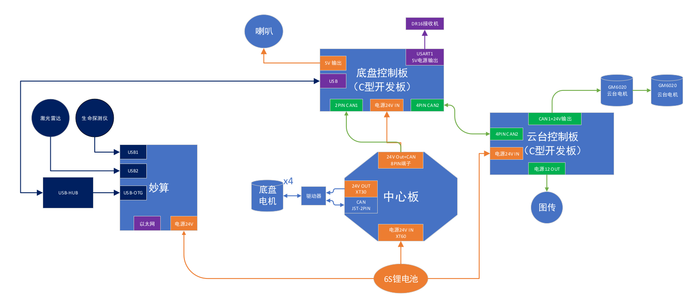

该机器人的底盘和云台两部分都配置了RoboMasterA型开发板，两块开发板之间，底盘电机和底盘控制板，云台电机和云台开发板都是通过can总线进行数据传输，CAN总线与其他总线相比，CAN总线通信最高速率可达1Mbps，并且数据传输可靠性高，电路结构简单；妙算与底盘控制板通过USB进行通信，激光雷达，工业相机和高精度IMU通过USB串口与妙算进行通讯。该机器人通过WIFI与第三方设备进行通信。

### 2.3 电机选型

#### 2.3.1 底盘电机分析

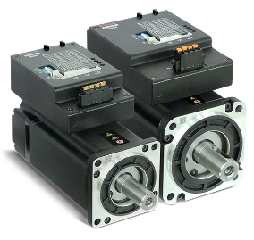

该机器人所使用的底盘电机为步科的MD系列集成式低压伺服电机，是一款专为机器人量身打造的高性能伺服电机，该产品具有如下特性:

* 供电范围宽：支持24～70VDC 宽电压；
* 功率选择多： 200～750W 多个功率可选；
* 产品体积小：驱动器与电机集成一体化，结构空间更紧凑；
* 过载能力强：具有3倍过载能力；
* 通讯方式广：支持RS232、CANopen、Modbus RTU、EtherCAT( 可定制) 等；
* 安全性能高：具有过压保护、欠压保护、短路保护、电机过热（I²T）保护、驱动器过热保护等多种安全保护措施；
* 专用功能全：增加报警同步制动、24V 抱闸电源输出、增强电池续航能力等物流行业专用功能。
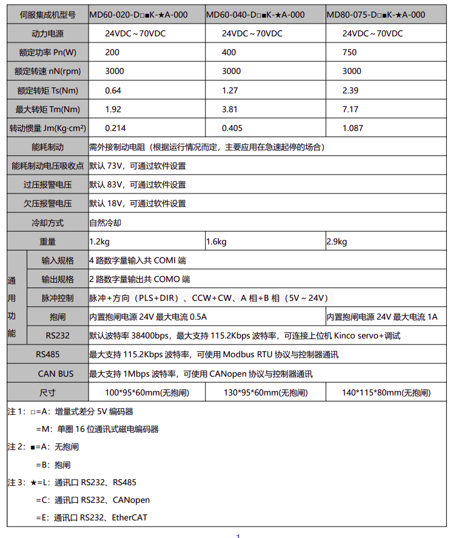

#### 2.3.2 云台电机分析

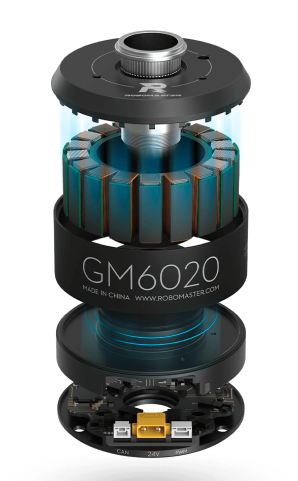

该机器人所使用的云台电机型号为GM6020,它是一款内部集成驱动器的高可靠性直流无刷电机。高极数设计，稀土材料磁铁及分数槽集中绕组方式确保电机输出更大的扭矩，可为低转速，大扭矩直接驱动应用提供高性能的解决方案。驱动器采用磁场定向控制(FOC)算法，配合高精度的角度传感器，能实现精确的力矩和位置控制。该电机具有如下产品特性：

* 空心轴结构，用户可根据需求安装滑环配件
* 电机和驱动器一体化设计，结构紧凑，集成度高
* 支持多种通讯方式(CAN，ＰＷＭ)
* 支持使用RoboMaster Assisstant软件进行在线调参和升级
* 通过CAN总线可以获取转子位置，转子速度，电机温度等信息
* 支持通过拨码开关设置ID和选通CAN终端电阻
* 具有过温和过压保护等功能


### 2.4 计算设备分析

#### 2.4.1 嵌入式控制板分析

该机器人所使用的嵌入式开发板为RoboMasterA型开发板，主控芯片为STM32F427IIH6,拥有丰富的扩展接口和通信接口，包括12V\5V\3.3V电源接口、CAN接口、UART接口、可变电压PWM接口、SWD接口等。


RoboMasterA型开发板可使用4S-6S锂电池。可以连接舵机、遥控器接收机、妙算、单轴陀螺仪、电子调速器、蓝牙模块、PC、OLED等多种配件。


#### 2.4.2 机载电脑分析

该机器人所使用的机载电脑为妙算２(Manifold 2-G(128G))进行算法实现，该设备的性能参数如下图所示：


由于我们的机器人需要解决定位和导航问题，需要实时获取和处理激光雷达数据和大量图像数据，还要运行深度神经网络算法，如yolov3算法对目标物体进行检测和识别，并且机器人上需要装载许多传感器等硬件，空间有限，所以我需要一台计算能力强，体型小巧的计算平台，妙算２符合上述要求。

### 2.5 传感器选型和用途

#### 2.5.1 激光雷达分析

激光雷达是一款比较昂贵的传感器，由于我们的试验场地是在室内环境下进行的，所以我选择的是思岚A3激光雷达，价格适中。室内环境下，在白色物体下最大测量距离为25m，测量盲区为0.2m，采样频率为16KHz,角度分辨率为0.225°，扫描频率最大可达15HZ。我们的测试环境长宽都远小于25ｍ，可以使用。在面对不同的使用场景时，我们可以根据参数来更换合适的激光雷达，在本次毕业设计中我们仅需要验证算法即可。

#### 2.5.2 视觉摄像头分析

该机器人所使用的为SKT-CL130C-127AA1-V1工业相机。相机内置１/2.7英寸CMOS图像传感器，最大分辨率支持1280*1024,在130W像素下帧率可达120fps。所选镜头焦距有可变焦和定焦镜头，分别应用于不同场景。

#### 2.5.3 高精度IMU分析

高精度IMU的主要作用是获取机器人的航向角信息，来修正机器人的姿态，我所选用的传感器为三驰惯性SC-AHRS-100D2高精度IMU，由惯性测量单元、磁传感器构成。产品内部嵌入扩展卡尔曼滤波算法，提供精确的磁航向、姿态角等角度信息。性能指标如下图所示：


## 第3章 四轮巡视探测机器人软件平台设计

### 3.1 引言

机器人的硬件系统和软件系统共同构建了一个可以由人来操控的平台，该平台可以进行感知，决策，运动规划，本章将对机器人的软件方案进行分析和设计，从机器人的底盘控制，陀螺仪姿态结算，云台控制三个方向展开讨论，并结合上一章的硬件体系结构，提出姿态解算和云台控制的具体实现方法。

### 3.２ 移动机器人运动控制技术

移动机器人的运动控制就是通过调节机器人的运动速度和运动方向，使机器人沿期望的轨迹进行运动。本次毕业设计所采用的为四轮独立驱动，该结构特点是将四个独立驱动电机安装在每个车轮上，通过控制这四个电机的速度从而控制四个车轮的转速和转矩，实现机器人的转向运动，通过四轮独立驱动的特点，可使所有车轮均绕同一瞬时旋转中心转向，实现不同转向半径转向甚至原地零半径转向。

#### 3.２.1 移动机器人的运动学模型

##### 3.２.1.1转向运动学分析

四轮独立驱动转向运动学和动力学模型，如下图所示


上图所示，四轮移动机器人的左右两轮轮距为Ｌ，前后轮距为d。其中虚线所构成的直角三角形，斜边即为标示的中线Ｍiddle~set~，长的直角边即为检测到的中线Middle~tset~，偏差*error*即为短直角边，也就是检测到的中线与标示的中线差值。

由此可知：
$$
\theta=\arctan error/(p+d/2)\tag{3-1}\label{}
$$
式中，$\theta$为转向角。***p***为CCD视角的前瞻长度。

４个车轮转向角分别为$\theta$~fl~，$\theta$~fr~，$\theta$~rl~，$\theta$~rr~由上图显然可以得到 $\theta$~fl~$=\theta$~fr~$=\theta $~rl~$=\theta$~rr~$=\theta$，$\theta$~fl~（$\theta$~fr~，$\theta$~rl~，$\theta$~rr~)分别为左前轮（右前轮，左后轮，右后轮）的转向角。那么四个车轮对应的转向圆转过的角度的角速度 $\omega$~fl~= $\omega$~fr~= $\omega$~rl~= $\omega$~rr~$=\theta$。由于四个车轮的运动学分析是一样的，所以这里仅讨论左前轮的运动学。其中***V***~fl~为左前轮的合力提供的速度，***V***~y~为左前轮的实时圆轨迹的向心力提供的速度，***V~x~***为克服摩擦力提供的速度。四轮移动机器人的实时速度即为合力所提供的速度，并且实时速度可以通过速度编码器获得，假定实时速度为***V~r~***，那么可以得到：
$$
V_r=\omega R_m=\theta R_m\tag{3-2}\label{}
$$

$$
R_m=R_L+L/2\tag{3-3}\label{}
$$

式中：

* R~m~为四轮驱动模型的圆轨迹半径

* R~L~为左前轮圆轨迹的半径
* Ｌ为左右轮距

由式(1)，(2)，(3)可得
$$
R_m=V_r/\theta=V_r/\arctan(error/(p+d/2))\tag{3-4}\label{}
$$

$$
R_L=V_r/\arctan(error/(p+d/2))-L/2\tag{3-5}\label{}
$$

由此可得左前轮的向心力提供的向心速度：
$$
V_y=V_r-L\arctan(error/(p+d/2))/2\tag{3-6}\label{}
$$
根据速度的合成，即可通过式(4)向心速度求出左前车轮的合成速度：

$$
V_{fl}=V_y/\cos\theta=(V_y-L\arctan(error/(p+d/2))/2)/\cos(\arctan(p+d/2))\tag{3-7}\label{}
$$
且由左后轮的圆轨迹半径为R~bl~可知左后轮的合成速度：

$$
V_{rl}=\sqrt{(V_r/\arctan(error/(p+d/2))-L/2)^2+(D/2)^2}\tag{3-8}\label{}
$$

$$
V_{rl}=\arctan(error/(p+d/2))\cdot\sqrt{(V_r/error/(p+d/2)-L/2)^2+(d/2)^2}\tag{3-9}\label{}
$$

V~fl~，V~rl~，可同理求出。

##### 3.２.1.2转向动力学分析

机器人模型的转动轴方向包括纵向，横向，垂直平移运动和绕３个垂直轴线的转动。当分析四轮巡视探测机器人时，忽略车辆行驶过程中汽车的pitch,roll,垂直平动，固定车辆的运动坐标原点与四轮巡视探测机器人质心重合。由图可知：

横向运动方程：
$$
F_{yfl}\sin\theta_{fl}+F_{xfl}\cos\theta_{fl}+F_{yfr}\sin\theta_{fr}+\\
F_{xfr}\cos\theta_{fr}+F_{yrl}\sin\theta_{rl}+F_{xrl}\cos\theta_{rl}+\\F_{yrr}\sin\theta_{rr}+F_{xrr}\cos\theta_{rr}=m\dot{v}\sin\theta\tag{3-10}\label{}
$$
纵向运动方程：
$$
Ｆ_{yfl}\cos\theta_{fl}-F_{xfl}\sin\theta_{fl}+F_{yfr}\cos\theta_{fr}-\\F_{xfr}\sin\theta_{fr}+F_{yrl}\cos\theta_{rl}-F_{xrl}\sin\theta_{rl}+\\F_{yrr}\cos\theta_{rr}-F_{xrr}\sin\theta_{rr}=m\dot{v}\cos\theta\tag{3-11}\label{}
$$
横摆运动方程：
$$
a(F_{xfl}\sin\theta_{fl}+F_{xfl}\cos\theta_{fl})-b(F_{yrl}\sin\theta_{rl}+\\F_{xrl}\cos\theta_{rl})+a(F_{yfr}\sin\theta_{fr}+F_{xfr}\cos\theta_{fr})-\\b(F_{yrr}\sin\theta_{rr}+F_{xrr}\cos\theta_{rr})=J\ddot{\varphi}\tag{3-12}\label{}
$$
式中，$J$为车体的转动惯量；$m$为车体的质量，$a,b$分别为车体重心距前后轮轴线的距离；$\theta$为侧偏角；$\varphi$为横摆角；$w_r=\ddot{\varphi}$为横摆角速度。$F_{xfl},F_{xfr},F_{xrl},F_{xrr}$,分别为前左，前右，后左，后右车轮上的纵向力；$F_{yfl},F_{yfr},F_{yrl},F_{yrr}$分别为前左，前右，后左，后右车轮上的横向力

#### 3.２.2 移动机器人的控制基础

##### 3.２.2.1 CAN协议简介

CAN是控制器域网(Controller Area Network,CAN)的简称，是由研发和生产汽车电子产品著称的德国BOACH公司开发，并最终成为国际标准(ISO11898)，CAN是国际上应用最广泛的现场总线之一。在北美和西欧，CAN总线协议已经成为汽车计算机控制系统和嵌入式工业控制局域网的标准总线，，并且拥有以CAN为底层协议专为大型货车和重工机械车辆设计的J1939协议。

CAN总线由CAN_H和CAN_L两根线构成，各个设备一起挂载在总线上。


在本次毕业设计所使用的云台电机和底盘电机均采用CAN协议进行通讯，CAN协议比较复杂，一个完整的数据帧由下图中的各个部分组成：

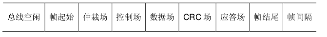

本文重点介绍CAN的仲裁场和数据场的内容。和I2C总线一样，每一个挂载在CAN总线上的CAN都有一个独有的ID，每当一个设备发送一帧数据时，总线其他设备会检查这个ID是否是自己需要接收数据的对象，如果是则接收本帧数据，如果不是则忽略。

ID存储在数据帧最前头的仲裁场，CAN的ID分为标准ID和拓展ID两类，标准ID长度为11位，如果设备过多，标准ID不够用的情况下，可以使用拓展ID，拓展ID的长度由２９位。

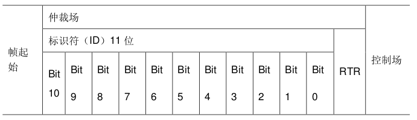

在通过ID判断本帧数据可以接收后，控制场中的DLC规定了本帧数据的长度，而数据场内的数据大小为8Byte，即8个8位数据。CAN总线的一个数据帧中所需要传输的有效数据实际上就是这8Byte。

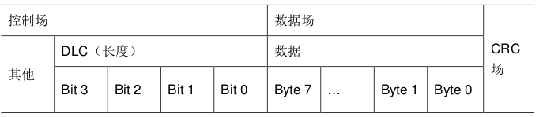

##### 3.２.2.2 电机使用

在本次毕业设计中，我所使用了两款型号的电机，一款是应用于底盘的步科的MD系列集成式低压伺服电机，另一款是应用于云台的RM6020电机。

在本章节中我们将以RM6020电机为研究对象进行说明，我从RM官网下载到该电机的数据手册，并在数据手册中查找和CAN通讯有关的内容，可以找到如下内容：

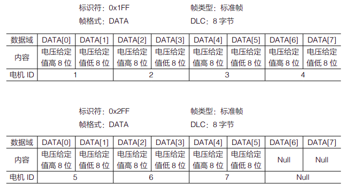

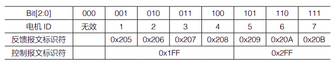

这是电机中的电调接收报文的格式，即如果要发送数据给１号到４号电调，控制电机输出的电流，从而控制电机转速时，需要按照表中的内容，将发送的CAN数据帧的ID设置为`0x1FF`，数据域中的8Byte数据按照电调１到４的高八位和低八位的顺序装填，帧格式和DLC也按照表中内容进行设置，最后进行数据的发送。

当腰接收电机中的电调发送来的数据时，则按照下表进行：

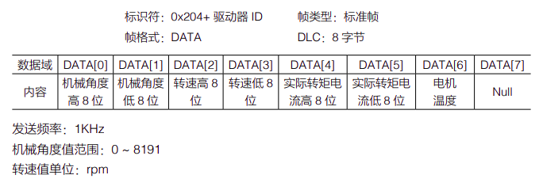

首先根据接收到的ID判断究竟接收到的是哪个电调发送来的数据，手册中规定１号电调ID为`0x205`，２号电调为`0x206`，３号电调为`0x207`，４号电调为`0x208`，判断完数据来源之后，就可以按照手册中的数据格式进行解码，通过高八位和低八位拼接的方式，得到电机的转子机械角度，转子转速，实际转矩电流，电机温度。

##### 3.２.2.3 CAN发送函数介绍

在本小节中，我将介绍CAN的发送函数，分别为 `CAN_cmd_chassis `函数和 `CAN_cmd_chassis` 函数，用于向底盘电机和云台电机发送CAN信号，控制电机运动，这是让电机运动的基本核心代码。

`CAN_cmd_chassis `函数的输入为电机１到电机４的驱动电流值 `motor1` 到` motor4`，函数会将期望值拆分成高八位和低八位，放入`8Byte`的CAN的数据域中，然后添加ID(`CAN_CHASSIS_ALL_ID 0x200`)，帧格式，数据长度等信息，形成一个完整的CAN数据帧，发送给各个电调。

```c
void CAN_cmd_chassis(int16_t motor1, int16_t motor2, int16_t motor3, int16_t motor4)
{
uint32_t send_mail_box;
chassis_tx_message.StdId = CAN_CHASSIS_ALL_ID;
chassis_tx_message.IDE = CAN_ID_STD;
chassis_tx_message.RTR = CAN_RTR_DATA;
chassis_tx_message.DLC = 0x08;
chassis_can_send_data[0] = motor1 >> 8;
chassis_can_send_data[1] = motor1;
chassis_can_send_data[2] = motor2 >> 8;
chassis_can_send_data[3] = motor2;
chassis_can_send_data[4] = motor3 >> 8;
chassis_can_send_data[5] = motor3;
chassis_can_send_data[6] = motor4 >> 8;
chassis_can_send_data[7] = motor4;
HAL_CAN_AddTxMessage(&CHASSIS_CAN, &chassis_tx_message,
chassis_can_send_data, &send_mail_box);
}
```

其中HAL库提供了实现CAN发送的函数`HAL_CAN_AddTXMessage`

```c
HAL_StatusTypeDef HAL_CAN_AddTxMessage(CAN_HandleTypeDef *hcan,
CAN_TxHeaderTypeDef *pHeader, uint8_t aData[], uint32_t *pTxMailbox)
```

| 函数名   | `HAL_CAN_AddTXMessage`                                       |
| :------- | ------------------------------------------------------------ |
| 函数功能 | 将一段数据通过 CAN 总线发送                                  |
| 返回值   | `HAL_StatusTypeDef`,HAL 库定义的几种状态,如果本次 CAN 发送成功,<br/>则返回 `HAL_OK` |
| 参数 1   | `CAN_HandleTypeDef *hcan`,即 can 的句柄指针,如果是 `can1 `就输入<br/>`&hcan1`,`can2 `就输入`&hcan2` |
| 参数 2   | `CAN_TxHeaderTypeDef *pHeader`,待发送的 CAN 数据帧信息的结构体指<br/>针,包含了 CAN 的 ID,格式等重要信息 |
| 参数 3   | `uint8_t aData[]`,装载了待发送的数据的数组名称               |
| 参数 4   | `uint32_t *pTxMailbox`,用于存储 CAN 发送所使用的邮箱号       |

`CAN_cmd_gimbal`函数的功能为向云台电机发送控制信号，输入参数为`yaw`轴电机，`pitch`轴电机的驱动电流期望值`yaw`，`pitch`，函数会将期望值拆分为高八位和低八位，放入`8Byte`的`CAN`的数据域中，然后添加ID(`CAN_GIMBAL_ALL_ID 0x1FF`)，帧格式，数据长度等信息，形成一个完整的`CAN`数据帧，发送给各个电调。

```c
void CAN_cmd_gimbal(int16_t yaw, int16_t pitch, int16_t shoot, int16_t rev)
{
uint32_t send_mail_box;
gimbal_tx_message.StdId = CAN_GIMBAL_ALL_ID;
gimbal_tx_message.IDE = CAN_ID_STD;
gimbal_tx_message.RTR = CAN_RTR_DATA;
gimbal_tx_message.DLC = 0x08;
gimbal_can_send_data[0] = (yaw >> 8);
gimbal_can_send_data[1] = yaw;
gimbal_can_send_data[2] = (pitch >> 8);
gimbal_can_send_data[3] = pitch;
gimbal_can_send_data[4] = (shoot >> 8);
gimbal_can_send_data[5] = shoot;
gimbal_can_send_data[6] = (rev >> 8);
gimbal_can_send_data[7] = rev;
HAL_CAN_AddTxMessage(&GIMBAL_CAN, &gimbal_tx_message,
gimbal_can_send_data, &send_mail_box);
}
```

##### 3.２.2.4 CAN接收中断回调介绍

在本小节中，我将介绍CAN的接收中断回调函数，HAL库提供了CAN的接收中断回调函数`HAL_CAN_RxFifo0MsgPendingCallback(CAN_HandleTypeDef *hcan)`，每当CAN完成一帧数据的接收时，就会触发一次CAN接收中断处理函数，接收中断函数完成一些寄存器的处理之后会调用CAN接收中断回调函数。

程序中，中断回调函数首先判断接受对象的ID，是否时需要的接收的电调发来的数据。完成判断之后，进行解码，将对应的电机的数据装入电机信息数组`motor_chassis`各个对应的位中。

```c
void HAL_CAN_RxFifo0MsgPendingCallback(CAN_HandleTypeDef *hcan)
{
	CAN_RxHeaderTypeDef rx_header;
	uint8_t rx_data[8];
	HAL_CAN_GetRxMessage(hcan, CAN_RX_FIFO0, &rx_header, rx_data);
	switch (rx_header.StdId)
	{
		case CAN_3508_M1_ID:
		case CAN_3508_M2_ID:
		case CAN_3508_M3_ID:
		case CAN_3508_M4_ID:
		case CAN_YAW_MOTOR_ID:
		case CAN_PIT_MOTOR_ID:
		case CAN_TRIGGER_MOTOR_ID:
		{
			static uint8_t i = 0;
			//get motor id
			i = rx_header.StdId - CAN_3508_M1_ID;
			get_motor_measure(&motor_chassis[i], rx_data);
			break;
		}
		default:
		{
			break;
		}
	}
}
```

接收时调用了HAL库提供的接收函数`HAL_CAN_GetRxMessage`

```c
HAL_StatusTypeDef HAL_CAN_GetRxMessage(CAN_HandleTypeDef *hcan, uint32_t RxFifo,
CAN_RxHeaderTypeDef *pHeader, uint8_t aData[])
```

| 函数名   | `HAL_CAN_GetRxMessage`                                       |
| :------- | ------------------------------------------------------------ |
| 函数功能 | 接收 CAN 总线上发送来的数据                                  |
| 返回值   | `HAL_StatusTypeDef`,HAL 库定义的几种状态,如果本次 CAN 接收成功,<br/>则返回 HAL_OK |
| 参数 1   | `CAN_HandleTypeDef *hcan`,即 can 的句柄指针,如果是 `can1 `就输入<br/>`&hcan1`,`can2 `就输入`&hcan2` |
| 参数 2   | `uint32_t RxFifo`,接收时使用的 CAN 接收 FIFO 号,一般为` CAN_RX_FIFO0` |
| 参数 3   | `CAN_RxHeaderTypeDef *pHeader`,存储接收到的 CAN 数据帧信息的结构<br/>体指针,包含了 CAN 的 ID,格式等重要信息 |
| 参数 4   | `uint8_t aData[]`,存储接收到的数据的数组名称                 |

`motor_chassis `为` motor_measure_t` 类型的数组,其中装有电机转子角度,电机转子转速,
控制电流,温度等信息。

```c
typedef struct
{
	uint16_t ecd;
	int16_t speed_rpm;
	int16_t given_current;
	uint8_t temperate;
	int16_t last_ecd;
} motor_measure_t;
```

解码功能实际上完成的工作是将接收到的数据按照高八位和第八位的方式进行拼接,从而得
到电机的各个参数。

```c
#define get_motor_measure(ptr, data)
{

	(ptr)->last_ecd = (ptr)->ecd;

	(ptr)->ecd = (uint16_t)((data)[0] << 8 | (data)[1]); 
	(ptr)->speed_rpm = (uint16_t)((data)[2] << 8 | (data)[3]); 
	(ptr)->given_current = (uint16_t)((data)[4] << 8 | (data)[5]); 
	(ptr)->temperate = (data)[6];
}

```

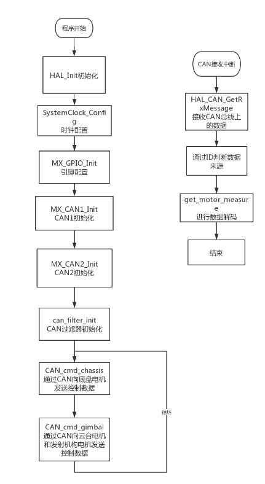


### 　3.３ 四轮巡视探测越障机器人的嵌入式算法设计

#### 3.３.1 云台结构的串级`PID`设计

四轮巡视探测机器人拥有一种两轴云台结构可以控制yaw轴和pitch轴的运动，而要控制这种两轴云台，就需要用到串级`PID`算法。`串级 PID `是通过两个控制器串级控制,串级控制往往是对同一自由度的不同物理量进行控制,例如机器人的云台控制是使用角速度环和角度环串级控制,角速度和角度均是属于旋转自由度,角速度是角度的微分。两个控制环节分为外环控制环节和内环控制,一般角度属于外环控制环节,角速度属于内环控制环节。串联是将外环的输出与内环的输入相连,外环角度环的输入是控制目标,外环角度环的输出是设定的角速度,为内环角速度环的输入。

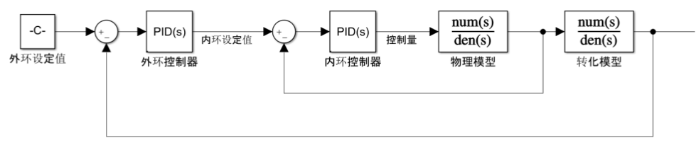

##### 3.３.1.1 `PID`原理

`PID`控制算法是应用最广泛的控制算法，小到控制一个元件的温度，大到控制无人机的飞行姿态和飞行速度，都可以使用`PID`控制。从原理上来说，`PID`(proportion integration differentiation)其实就是比例，积分，微分控制。
$$
U(t)=K_p(err(t)+\frac{1}{T_1}\int{err(t)dt}+\frac{T_Dderr(t)}{dt})\tag{3-13}\label{}
$$
括号内第一项时比例项，第二项是积分项，第三项是微分项，前面的$K_P$仅仅是一个系数，在大多数情况下，我们需要在离散的情况下使用，则控制器可以化为：
$$
U(k)=K_pe(k)+\frac{K_pT}{T_i}\sum_{n=0}^ke(n)+\frac{K_pT_d}{T}(e(k)-e(k-1))\tag{3-14}\label{}
$$
每一项前面都有系数，这些系数都需要在试验中调试，为了方便起见，需要将这些系数进行统一：
$$
U(k)=K_pe(k)+K_i\sum_{n=0}^ke(n)+K_d(e(k)-e(k-1))\tag{3-15}\label{}
$$
这样看就清晰多了，比例，微分，积分每个项前面都有一个系数，且为离散化的公式，很适合编程实现。

##### 3.３.1.2 `PID`程序实现

1. can发送电机控制函数

在机器人控制基础章节中，讲述了如何使用CAN通信进行控制电机。云台电机分配的 ID 分别是`0x205`, `0x206`,` 0x207` 和 `0x208`,它们都是由 ID 为` 0x1FF` 的 CAN 包进行控制,其中默认`0x205` 为 yaw 轴电机,`0x206` 为 pitch 轴电机,而在 CAN_`receive.c `中封装云台控制函数 `CAN_cmd_gimbal`。

| 函数名         | `CAN_cmd_gimbal`                                  |
| -------------- | ------------------------------------------------- |
| 函数功能       | 发送 ID 为` 0x205`-`0x208` 的电机电流控制值       |
| 函数返回       | None                                              |
| 参数 1:`yaw`   | ID 为 `0x205` 的电机电流控制值,范围[-30000,30000] |
| 参数 2:`pitch` | ID 为 `0x206` 的电机电流控制值,范围[-30000,30000] |
| 参数 3:`shoot` | ID 为 `0x207 `的电机电流控制值,范围[-16384,16384] |
| 参数 4:`res`   | ID 为` 0x208 `的电机电流控制值,为保留字节         |

   2.程序流程讲解

使用freeRTOS创建云台任务，云台任务主循环流程如下：

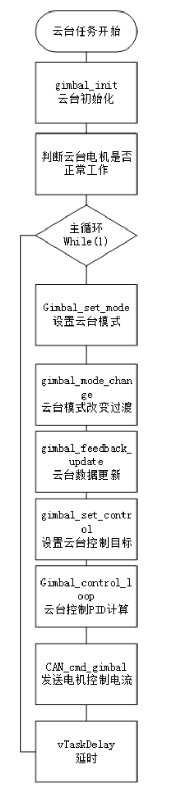

| 流程                                 | 功能                                                         |
| ------------------------------------ | ------------------------------------------------------------ |
| `gimbal_init`                        | 云台初始化,主要初始化电机角度` PID`,角速度`PID`,初始化遥控器指针,初始化姿态角度指针初始化电机数据指针。 |
| `gimbal_set_mode`                    | 根据遥控器的开关值决定云台控制行为,根据云台控制行为决定云台控制模式。 |
| `gimbal_mode_change_control_transit` | 云台控制模式切换过程中数据保存,以保证控制切换的控制目标平稳过渡。 |
| `gimbal_feedback_update`             | 云台电机反馈速度,姿态角度,角速度更新。                       |
| `gimbal_set_control`                 | 根据遥控器和鼠标的输入,计算角度的控制目标。                  |
| `gimbal_control_loop`                | 云台根据不同控制模式,计算不同 `PID`。                        |
| `CAN_cmd_gimbal`                     | 发送电机电流控制值                                           |

机器人云台常见的控制路线如图所示,由遥控器以及鼠标的通道值计算出角度 yaw,pitch
的控制目标值,由云台角度 PID 计算对应轴的角速度设定值,由角速度 PID 计算出电机的
CAN 命令控制量,再通过 CAN 总线发送到电机。

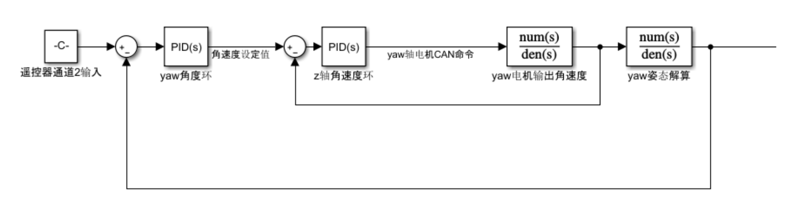

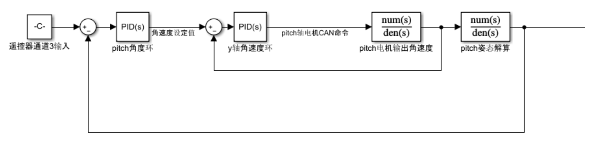

3.关键函数讲解

以下讲解的几个主要函数：

* `gimbal_set_mode`函数和`gimbal_behaviour_mode_set`函数

`gimbal_set_mode`函数调用`gimbal_behaviour_mode_set`函数完成设置控制模式。而在`gimbal_behaviour_mode_set`函数通过遥控器的开关决定云台的不同行为，然后通过不同行为决定不同云台的控制方式，行为模式和控制模式可以参考下表

  ```c
  static void gimbal_set_mode(gimbal_control_t *set_mode)
  {
  gimbal_behaviour_mode_set(set_mode);
  }
  static void gimbal_behavour_set(gimbal_control_t *gimbal_mode_set)
  {
  ...
  //开关控制 云台状态
  if (switch_is_down(gimbal_mode_set->gimbal_rc_ctrl->rc.s[GIMBAL_MODE_CHANNEL]))
  {
  gimbal_behaviour = GIMBAL_ZERO_FORCE;
  }
  else if (switch_is_mid(gimbal_mode_set->gimbal_rc_ctrl->rc.s[GIMBAL_MODE_CHANNEL]))
  {
  gimbal_behaviour = GIMBAL_RELATIVE_ANGLE;
  }
  else if (switch_is_up(gimbal_mode_set->gimbal_rc_ctrl->rc.s[GIMBAL_MODE_CHANNEL]))
  {
  gimbal_behaviour = GIMBAL_ABSOLUTE_ANGLE;
  }
  ...
  }
  ```

| 行为模式                | 云台表现以及应用                                             |
| ----------------------- | ------------------------------------------------------------ |
| `GIMBAL_ZERO_FORCE`     | 云台电机 CAN 发送的控制值为 0,云台表现为无力状态,应用于遥控器开关处于下位,需要云台停止运动的场合。 |
| `GIMBAL_INIT`           | 云台初始化模式,云台先缓慢抬起 pitch 轴,之后旋转yaw 轴至云台中点,应用于云台从停止运动到开启运动控制的过程阶段,防止云台在开电时过度运动导致机械机构损坏。 |
| `GIMBAL_CALC`           | 云台校准模式,用于云台计算云台中值的场合,云台先放下 pitch 轴,再抬起 pitch 轴,再逆时针旋转 yaw 轴,最后顺时针旋转 yaw 轴。在这个过程中,采集电机的反馈角度,用于计算云台中值 。 |
| `GIMBAL_ABSOLUTE_ANGLE` | 云台使用姿态解算出的姿态角进行角度控制,由于姿态角是相对地面坐标系,不随底盘的姿态角度而不变化,适用于机器人正常运动控制。 |
| `GIMBAL_RELATIVE_ANGLE` | 云台使用电机反馈的角度进行角度控制,由于电机角度是相对底盘坐标系,跟随底盘的姿态角度,适用于机器人在特殊场合下的控制运动控制 |
| `GIMBAL_MOTIONLESS`     | 云台静止不动,保证原先的电机角度控制,适用于机器人在长时间静止不动的控制运动控制,减少陀螺仪漂移造成的影响。 |

  云台电机控制模式分为三种，如下表所示：

| 控制模式               | 功能以及应用                                                 |
| ---------------------- | ------------------------------------------------------------ |
| `GIMBAL_MOTOR_RAW`     | 云台电机控制值直接发送 CAN 包,是` GIMBAL_CALI`和 `GIMBAL_ZERO_FORCE` 选择的电机控制模式。 |
| `GIMBAL_MOTOR_GYRO`    | 云台电机的控制目标是陀螺仪解算的角度,是`GIMBAL_ABSOLUTE_ANGLE `选择的电机控制模式。 |
| `GIMBAL_MOTOR_ENCONDE` | 云台电机的控制目标是电机反馈的角度,是`GIMBAL_RELATIVE_ANGLE`，`GIMBAL_MOTOR_ENCONDE`，`GIMBAL_MOTIONLESS`, `GIMBAL_INIT `选择的电机控制模式。 |

* `gimbal_set_control` 函数和 `gimbal_behaviour_conotrol_set `函数

`gimbal_set_control`函数调用` gimbal_behaviour_conotrol_set `函数得到云台两个自由度
运动的控制目标值。`gimbal_behaviour_control_set` 函数根据不同的云台行为模式调用
不同函数,在对应的函数设置不同控制量。

```c
static void gimbal_set_control(gimbal_control_t *set_control)
{
fp32 add_yaw_angle = 0.0f;
fp32 add_pitch_angle = 0.0f;
gimbal_behaviour_control_set(&add_yaw_angle, &add_pitch_angle, set_control);
//yaw 电机模式控制
if (set_control->gimbal_yaw_motor.gimbal_motor_mode == GIMBAL_MOTOR_RAW)
{
//raw 模式下,直接发送控制值
set_control->gimbal_yaw_motor.raw_cmd_current = add_yaw_angle;
}
else if (set_control->gimbal_yaw_motor.gimbal_motor_mode == GIMBAL_MOTOR_GYRO)
{
//gyro 模式下,陀螺仪角度控制
gimbal_absolute_angle_limit(&set_control->gimbal_yaw_motor, add_yaw_angle);
}
else if (set_control->gimbal_yaw_motor.gimbal_motor_mode == GIMBAL_MOTOR_ENCONDE)
{
//enconde 模式下,电机编码角度控制
gimbal_relative_angle_limit(&set_control->gimbal_yaw_motor, add_yaw_angle);
}
...
}
```

* `gimbal_absolute_angle_limit` 函数

`gimbal_absolute_angle_limit` 函数功能是云台在陀螺仪角度控制模式下,限制最大角度以防止云台旋转超过最大角度,损坏限位机构。
  1) 计算当前设定目标角度与当前角度的误差角度;
  2) 判断电机反馈的角度加上误差角度和增加角度是否会超过最大相对角度;
  3) 如果超过最大角度,修改增加角度;
  4) 将增加角度加到设定目标角度上。

```c
static void gimbal_absolute_angle_limit(gimbal_motor_t *gimbal_motor, fp32 add)
{
static fp32 bias_angle;
static fp32 angle_set;
if (gimbal_motor == NULL)
{
return;
}
//now angle error
//当前控制误差角度
bias_angle = rad_format(gimbal_motor->absolute_angle_set - gimbal_motor->absolute_angle);
//relative angle + angle error + add_angle > max_relative angle
//云台相对角度+ 误差角度 + 新增角度 如果大于 最大机械角度
if (gimbal_motor->relative_angle + bias_angle + add > gimbal_motor->max_relative_angle)
{
//如果是往最大机械角度控制方向
if (add > 0.0f)
{
//calculate max add_angle
//计算出一个最大的添加角度,
add = gimbal_motor->max_relative_angle - gimbal_motor->relative_angle - bias_angle;
}
}
else if (gimbal_motor->relative_angle + bias_angle + add < gimbal_motor->min_relative_angle)
{
if (add < 0.0f)
{
add = gimbal_motor->min_relative_angle - gimbal_motor->relative_angle - bias_angle;
}
}
angle_set = gimbal_motor->absolute_angle_set;
gimbal_motor->absolute_angle_set = rad_format(angle_set + add);
}
```


#### 3.３.2` IMU`传感器的姿态解算

如果我们要准确的控制机器人的运动，就需要对机器人的惯性传感器进行姿态结算，所谓姿态解算，就是将陀螺仪的角速度数据，加速度计的加速度数据，磁力计的磁场数据进行融合，以解算出当前载体的姿态角。所以姿态解算算法的好坏将影响到姿态角度的精度。在本小结中我将以`mahony`算法为例，移植相关算法到`STM32单片机`中，创建姿态解算任务，同时我将阐明如何通过`SPI`的`DMA`方式获取陀螺仪数据。


##### 3.３.2.1 姿态角简介

姿态是反应物体相对于参考坐标系的指向。常使用欧拉角代表物体的姿态,描述物体姿态需要三个角度,分别是 yaw(偏航角), pitch(俯仰角),roll(横滚角)。Yaw(偏航角)是绕 z 轴的角度,pitch 是绕 y 轴的角度,roll 是绕 x 轴的角度。四轮巡视探测机器人具有两轴云台,分别是 yaw 轴和 pitch 轴。如图所示：

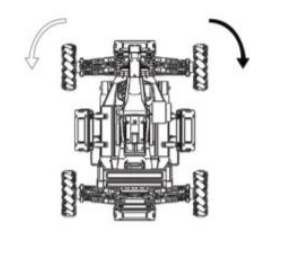

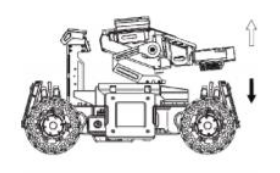

##### 3.３.2.2 `mahony`算法原理

`mahony`算法原理，就是根据加速度计和地磁计的数据，转换到地理坐标系后，与对应参考的重力向量和地磁向量进行求误差，这个误差用来矫正陀螺仪的输出，然后用陀螺仪数据进行四元数更新，再转到欧拉角，具体步骤如下：

* 根据三维电子罗盘和加速度计的输出求取姿态角：

$$
\begin{bmatrix}roll \\ pitch \end{bmatrix}=\begin{bmatrix}\arctan({-a_y\over-a_z}) \\ \arctan({a_x\over-a_z}) \end{bmatrix}\tag{3-16}\label{}
$$

* 机体坐标系相对于地理坐标系的方位为机体的姿态，如果设 $\phi$，$\theta$，$\psi$为机体的横滚角，俯仰角和航向角，三轴磁分量数据为 $mx,my,mz$。如果 $\psi=0$，那么机体坐标系和地理坐标系间的转换矩阵为：

$$
T=\begin{bmatrix}\cos(\theta) & 0 & -\sin(-\theta) \\ 0 & 1 & 0\\  \sin(-\theta) & 0 & \cos(\theta) \end{bmatrix} \begin{bmatrix}1 & 0 & 0 \\ 0 & \cos(\phi) & \sin(-\phi)\\ 0 & -\sin(-\phi) & \cos(\phi) \end{bmatrix}=\\
\begin{bmatrix}\cos(\theta) & \sin(\phi)\sin(\theta) & \cos(\phi)\sin(\theta) \\ 0 & \cos(\phi) & -\sin(\phi)\\  -\sin(\theta) & \sin(\phi)\cos(\theta) & \cos(\phi)\cos(\theta) \end{bmatrix} \tag{3-17}\label{}
$$

* 根据姿态角信息与电子罗盘的三轴磁力计数据求取计算偏航角所需的参数：

$$
\begin{bmatrix}X_k \\ Y_k \\ Z_k \end{bmatrix}=\begin{bmatrix}\cos(\theta) & \sin(\phi)\sin(\theta) & \cos(\phi)\sin(\theta) \\ 0 & \cos(\phi) & -\sin(\phi)\\  -\sin(\theta) & \sin(\phi)\cos(\theta) & \cos(\phi)\cos(\theta) \end{bmatrix}\begin{bmatrix}m_x \\ m_y \\ m_z \end{bmatrix} \tag{3-18}\label{}
$$

上式中：X~k~,Y~k~,Z~k~分别为机体水平姿态角为零时地磁场在机体坐标系X~b~,Y~b~,Z~b~方向的分量。

* 航向角可以由以下公式计算得到：

$$
\psi =
\begin{cases}
180-\arctan(\frac{Y_k}{X_K}), & { X_k < 0} \\[1ex]
-\arctan(\frac{Y_k}{X_K}), & {X_k>0,Y_k<0} \\[1ex]
360-\arctan(\frac{Y_k}{X_K}),&{X_k>0,Y_k>0}\\[1ex]
90 ,&{X_k=0,Y_k<0}\\[1ex]
270,&{X_k=0,Y_k>0}
\end{cases}\tag{3-19}\label{}
$$

* 根据X~k~,Y~k~数值一般的变化范围可以得到：
  $$
  \psi=-\arctan(\frac{Y_k}{X_k})\tag{3-20}\label{}
  $$
  所以有：
  $$
  \begin{bmatrix}mag_x \\ mag_y  \end{bmatrix}=\begin{bmatrix}\cos(pitch) & \sin(roll)\sin(pitch) & \cos(roll)\sin(pitch) \\ 0 & \cos(roll) & -\sin(roll)\\   \end{bmatrix}\begin{bmatrix}m_x \\ m_y \\ m_z \end{bmatrix} \tag{3-21}\label{}
  $$

* 航向角可以通过 $\arctan(\frac{-mag_y}{mag_x})$求得，所以姿态角为：
  $$
  \begin{bmatrix}roll \\ pitch　\\ yaw \end{bmatrix}=\begin{bmatrix}\alpha \\ \gamma \\ \beta  \end{bmatrix}=\begin{bmatrix}\arctan({-a_y\over a_z}) \\ \arctan({a_x\over-a_z})\\ \arctan(\frac{-mag_y}{mag_x}) \end{bmatrix}\tag{3-22}\label{}
  $$
  
* 

$$
\begin{bmatrix}q_0 \\ q_1 \\ q_2 \\ q_3 \end{bmatrix}=\begin{bmatrix}\cos(\frac{\alpha}{2})\cos(\frac{\beta}{2})\cos(\frac{\gamma}{2})+\sin(\frac{\alpha}{2})\sin(\frac{\beta}{2})\sin(\frac{\gamma}{2}) \\ \sin(\frac{\alpha}{2})\cos(\frac{\beta}{2})\cos(\frac{\gamma}{2})-\cos(\frac{\alpha}{2})\sin(\frac{\beta}{2})\sin(\frac{\gamma}{2}) \\ \cos(\frac{\alpha}{2})\cos(\frac{\beta}{2})\sin(\frac{\gamma}{2})+\sin(\frac{\alpha}{2})\sin(\frac{\beta}{2})\cos(\frac{\gamma}{2}) \\ \cos(\frac{\alpha}{2})\sin(\frac{\beta}{2})\cos(\frac{\gamma}{2})-\sin(\frac{\alpha}{2})\cos(\frac{\beta}{2})\sin(\frac{\gamma}{2})  \end{bmatrix}\tag{3-23}\label{}
$$

* 用四元数求取转换矩阵：
  $$
  \begin{bmatrix}T_{11} & T_{12} & T_{13} \\ T_{21} & T_{22} & T_{23} \\ T_{31} & T_{32} & T_{33} \end{bmatrix} = \begin{bmatrix}1-2(q_2^2+q_3^2) & 2(q_1q_2+q_0q_3) & 2(q_1q_3-q_0q_2) \\ 2(q_1q_2-q_0q_3) & 1-2(q_1^2+q_3^2) & 2(q_2q_3+q_0q_1) \\ 2(q_1q_3+q_0q_2) & 2(q_2q_3+q_0q_1) & 1-2(q_1^2+q_2^2) \end{bmatrix}\tag{3-24}\label{}
  $$

* 对罗盘输出的数据进行归一化处理：
  $$
  \begin{bmatrix}m_x \\ m_y \\ m_z \end{bmatrix}＝\frac{1}{\sqrt{m_x^2+m_y^2+m_Z^2}}\begin{bmatrix}m_x \\ m_y \\ m_z \end{bmatrix}\tag{3-25}\label{}
  $$

* 由电子罗盘的输出计算地球磁场的参考方向：
  $$
  \begin{bmatrix}h_x \\ h_y \\ h_z \end{bmatrix}=\begin{bmatrix}1-2(q_2^2+q_3^2) & 2(q_1q_2+q_0q_3) & 2(q_1q_3-q_0q_2) \\ 2(q_1q_2-q_0q_3) & 1-2(q_1^2+q_3^2) & 2(q_2q_3+q_0q_1) \\ 2(q_1q_3+q_0q_2) & 2(q_2q_3+q_0q_1) & 1-2(q_1^2+q_2^2) \end{bmatrix}\begin{bmatrix}m_x \\ m_y \\ m_z \end{bmatrix}\tag{3-26}\label{}
  $$

  $$
  \begin{bmatrix}b_x \\ b_y \\ b_z \end{bmatrix}=\begin{bmatrix}\sqrt{h_x^2+h_y^2} \\ 0 \\ h_z \end{bmatrix}\tag{3-27}\label{}
  $$

* 估计磁场方向：
  $$
  \begin{bmatrix}w_x \\ w_y \\ w_z \end{bmatrix}=\begin{bmatrix}\frac{1}{2}-q_2^2-q_3^2 & q_1q_2-q_0q_3 & q_1q_3+q_0q_2 \\ q_1q_2+q_0q_3 & \frac{1}{2}-q_1^2-q_3^2 & q_2q_3-q_0q_1 \\ q_1q_3-q_0q_2 & q_2q_3+q_0q_1 & \frac{1}{2}-q_1^2-q_2^2 \end{bmatrix}\begin{bmatrix}b_x \\ 0 \\ b_z \end{bmatrix}\tag{3-28}\label{}
  $$
  
* 估计方位和测量方位叉乘之后累积：
  $$
  \begin{bmatrix}e_x \\ e_y \\ e_z \end{bmatrix}=\begin{bmatrix}e_x \\ e_y \\ e_z \end{bmatrix}+m\otimes w =\begin{bmatrix}e_x+m_yw_z-m_zw_y  \\ e_y+m_zw_x-m_xw_z\\ e_z+m_xw_y-m_yw_x \end{bmatrix}\tag{3-29}\label{}
  $$

* 归一化加速度计输出：
  $$
  \begin{bmatrix}a_x \\ a_y \\ a_z \end{bmatrix}=\frac{1}{\sqrt{a_x^2+a_y^2+a_Z^2}}\begin{bmatrix}a_x \\ a_y \\ a_z \end{bmatrix}\tag{3.3.2.2-15}\label{}
  $$

* 计算重力和磁场的方位：
  $$
  \begin{bmatrix}v_x \\ v_y \\ v_z \end{bmatrix}=\begin{bmatrix}q_1q_3-q_0q_2 \\ q_0q_1+q_2q_3 \\ q_0^2+q_3^2-\frac{1}{2} \end{bmatrix}\tag{3-30}\label{}
  $$

* 估计方位和测量方位向量叉乘后累积：
  $$
  \begin{bmatrix}e_x \\ e_y \\ e_z \end{bmatrix}=\begin{bmatrix}e_x \\ e_y \\ e_z \end{bmatrix}+a\otimes v =\begin{bmatrix}e_x+a_yv_z-a_zv_y  \\ e_y+a_zv_x-a_xv_z\\ e_z+a_xv_y-a_yv_x \end{bmatrix}\tag{3-31}\label{}
  $$

* 对陀螺输出的角度进行修正：
  $$
  \begin{bmatrix}g_x \\ g_y \\ g_z \end{bmatrix}+K_p \dot=\begin{bmatrix}g_x \\ g_y \\ g_z \end{bmatrix}+K_p \bullet\begin{bmatrix}e_x \\ e_y \\ e_z \end{bmatrix}+K_f\bullet\begin{bmatrix}\int{e_x}\\ \int{e_y} \\ \int{e_z} \end{bmatrix}\tag{3-32}\label{}
  $$

* 通过修正后的角速度与四元数来计算四元数的导数：
  $$
  \begin{bmatrix}\dot{q_0} \\ \dot{q_1} \\ \dot{q_2} \\ \dot{q_3} \end{bmatrix}=\frac{1}{2}\begin{bmatrix}0 & -g_x & -g_y & -g_z\\ g_x & 0 & g_z & -g_y \\ g_y & -g_z & 0 & g_x \\ g_z & g_y & -g_x & 0 \end{bmatrix}\begin{bmatrix}q_0 \\ q_1 \\ q_2 \\ q_3 \end{bmatrix}\tag{3-33}\label{}
  $$

* 积分四元数的导数得到新的四元数：
  $$
  \begin{bmatrix}q_0 \\ q_1 \\ q_2 \\ q_3 \end{bmatrix}＝\begin{bmatrix}\int{\dot{q_0}} \\ \int{\dot{q_1}} \\ \int{\dot{q_2}} \\ \int{\dot{q_3}} \end{bmatrix}\tag{3-34}\label{}
  $$

* 姿态转换矩阵为：
  $$
  \begin{bmatrix}T_{11} & T_{12} & T_{13} \\ T_{21} & T_{22} & T_{23} \\ T_{31} & T_{32} & T_{33} \end{bmatrix}＝\begin{bmatrix}q_0^2+q_1^2-q_2^2-q_3^2 & 2(q_1q_2+q_0q_3) & 2(q_1q_3-q_0q_2) \\ 2(q_1q_2-q_0q_3) & q_0^2-q_1^2+q_2^2-q_3^2 & 2(q_2q_3+q_0q_1) \\ 2(q_1q_3+q_0q_2) & 2(q_2q_3+q_0q_1) & q_0^2-q_1^2-q_2^2+q_3^2 \end{bmatrix}\tag{3-35}\label{}
  $$

* 姿态角为：
  $$
  \begin{bmatrix}euler_x \\ euler_y \\ euler_z \end{bmatrix}=\begin{bmatrix}\arctan(\frac{T_{23}}{T_{33}}) \\ -\arcsin(T_{13}) \\ \arctan(\frac{T_{12}}{T_{11}}) \end{bmatrix}\tag{3-36}\label{}
  $$

##### 3.３.2.3　四元数与姿态角的转化

  在上一节中我详细讲解了`mahony`算法的计算过程，在本节中我将重点讲述四元数与姿态角的转化，我们经常使用欧拉角表示姿态，但时欧拉角有很多缺点，例如欧拉角是不可传递的，旋转的顺序影响旋转的结果，不同的应用有可能适用于不同的旋转顺序，旋转顺序无法统一，其次欧拉角可能造成万象节死锁．而四元数便不会出现万象节死锁，使用起来也非常方便

我们可以使用单位四元数代表姿态，四元数使用４个参数代表，如下式所示：
$$
Q=q_0+q_1i+q_2j+q_3j\tag{3-37}\label{}
$$
由于是单位四元数，需要满足平方和等于１，如下式所示：
$$
q_0^2+q_1^2+q_2^2+q_3^2=1\tag{3-38}\label{}
$$
在欧拉角旋转顺序为 $yaw-pitch-roll$，四元数转化成欧拉角的公式为：
$$
yaw=\arctan(\frac{q_0*q_3+q_1*q_2}{q_0^2+q_1^2-0.5})\tag{3-39}\label{}
$$

$$
pitch = \arcsin(2*q_0*q_2-2*q_1*q_3)\tag{3-40}\label{}
$$

$$
roll=\arctan(\frac{q_0*q_1+q_2*q_3}{q_0^2+q_3^2-0.5})\tag{3-41}\label{}
$$

四元数使用陀螺仪的数据进行积分，积分迭代公式为：
$$
q_0^k=q_0^{k-1}-(q_1^{k-1}*g_x-q_2^{k-1}*g_y-q_3^{k-1}*g_z)*0.5*t\tag{3-42}\label{}
$$

$$
q_1^k=q_1^{k-1}+(q_0^{k-1}*g_x+q_2^{k-1}*g_z-q_3^{k-1}*g_y)*0.5*t\tag{3-43}\label{}
$$

$$
q_2^k=q_2^{k-1}+(q_0^{k-1}*g_y-q_1^{k-1}*g_z+q_3^{k-1}*g_x)*0.5*t\tag{3-44}\label{}
$$

$$
q_3^k=q_3^{k-1}+(q_0^{k-1}*g_z+q_1^{k-1}*g_y-q_2^{k-1}*g_x)*0.5*t\tag{3-45}\label{}
$$

其中：

* $g_x,g_y,g_z$，为陀螺仪的 $x,y,z$轴数据
* $t$为定时时间，程序设定更新频率为$1000Hz$，故而$t=0.001$．

##### 3.３.2.4 在`cubeMX`中配置`GPIO,SPI`以及`I2C`

在本次毕业设计中，我使用的`IMU`型号为`BMI088`,在进行姿态解算时，我需要融合磁力计数据，陀螺仪数据，加速度数据，故而需要配置陀螺仪和加速度计的`DRDY`引脚，并配置成外部中断的模式，下图为`IMU`相关的硬件原理图．

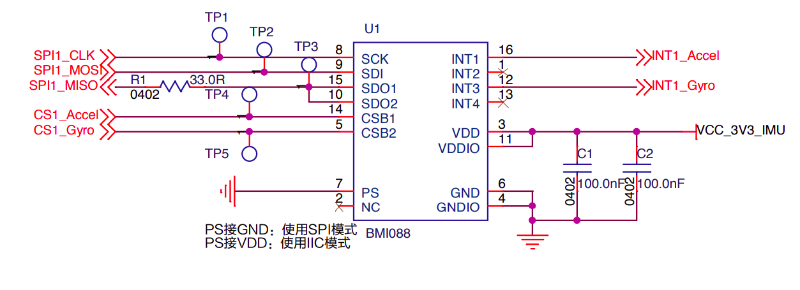

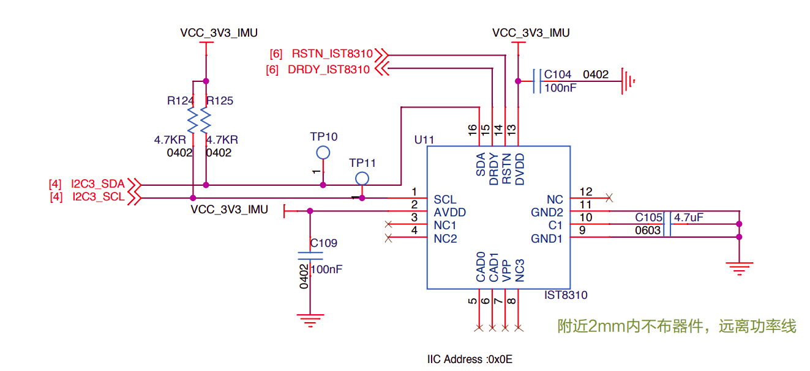

$MCU$硬件引脚对应表：

| $MCU$引脚 | 硬件原理图名称  | 功能                             |
| --------- | --------------- | -------------------------------- |
| $PA7$     | $SPI1\_MOSI$    | $SPI1$的$MOSI$                   |
| $PB3$     | $SPI1\_CLK$     | $SPI1$ 的 $CLK$                  |
| $PB4$     | $CS1\_Accel$    | 加速度计的片选,低电平有效        |
| $PB0$     | $CS1\_Gyro$     | 陀螺仪的片选,低电平有效          |
| $PC4$     | $INT1\_Accel$   | 加速度计的 $DRDY$,外部下降沿中断 |
| $PC5$     | $INT1\_Gyro$    | 陀螺仪的 $DRDY$,外部下降沿中断   |
| $PA8$     | $I2C3\_SDA$     | $I2C$ 的 $SCL$                   |
| $PC9$     | $I2C3\_SCL$     | $I2C$ 的 $SDA$                   |
| $PG3$     | $DRDY\_IST8310$ | 磁力计的 $DRDY$,外部下降沿中断   |
| $PG6$     | $RSTN\_IST8310$ | 磁力计的 $RSTN$,低电平有效       |

##### 3.３.2.4 `mahony`代码移植

`mahony`算法时常见的姿态融合算法，将加速度计，磁力计，陀螺仪共九轴数据，融合解算出载体四元数，`mahony`算法可以到如下网站中下载源码．https://x-io.co.uk/open-source-imu-and-ahrs-algorithms/

下载压缩包 `madgwick_algorithm_c.zip`,解压后移植`MahonyAHRS``文件下的文件到程序内．原始文件内有以下参数．

| 参数                                              | 意义                                                | 设置值                      |
| ------------------------------------------------- | --------------------------------------------------- | --------------------------- |
| $sampleFreq$                                      | 采样频率                                            | $1000.0f ( 原 始 值512.0f)$ |
| $twoKpDef$                                        | 加速度计以及磁力计融合权重 $Kp$,值越大,收敛速度越快 | $2.0f*0.5f$                 |
| $twoKpDef$                                        | 加速度计以及磁力计融合权重 Ki,值越大,收敛速度越快   | $2.0f*0.0f$                 |
| $twoKp$                                           | $twoKpDef$ 宏赋值变量                               | $twoKpDef$                  |
| $TwoKi$                                           | $twoKiDef$ 宏赋值变量                               | $twoKiDef$                  |
| $q0,q1,q2,q3$                                     | 四元数                                              | [1.0,0,0,0]                 |
| $integralFBx$<br/>$integralFBy$<br/>$integralFBz$ | 误差积分值                                          | $0.0f$                      |

1. `MahonyAHRSupdate`​函数

   ```c
   void MahonyAHRSupdate(float q[4], float gx, float gy, float gz, float ax, float ay, float az, float mx, float my, float mz)
   ```

   | 函数名                 | `MahonyAHRSupdate`​                      |
   | ---------------------- | --------------------------------------- |
   | 功能                   | 融合陀螺仪,加速度,磁力计数据,更新四元数 |
   | 函数返回               | None                                    |
   | 参数 $1:q[4]$          | 四元数数组                              |
   | 参数 2,3,4:$gx,gy,gz$  | 陀螺仪角速度数据                        |
   | 参数 5,6,7:$ax,ay,az$  | 加速度计加速度数据                      |
   | 参数 8,9,10:$mx,my,mz$ | 磁力计磁场数据                          |

该函数实现过程：

   * 对加速度计数据以及磁力计数据进行归一化处理，使得加速度和磁场数据平方和等于１，即：
     $$
     a_x^2+a_y^2+a_z^2=1
     $$

     $$
     m_x^2+m_y^2+m_z^2=1
     $$

* 旋转磁场数据，计算当前四元数姿态方向．

* 当前四元数姿态方向与加速度测量方向和磁力计测量方向做差

* 进行PI补偿陀螺仪数据

* 根据公式，使用陀螺仪数据更新四元数数据，具体代码如下：

  ```c
  gx *= (0.5f * (1.0f / sampleFreq));
  // pre-multiply common factors
  gy *= (0.5f * (1.0f / sampleFreq));
  gz *= (0.5f * (1.0f / sampleFreq));
  qa = q[0];
  qb = q[1];
  qc = q[2];
  q[0] += (-qb * gx - qc * gy - q[3] * gz);
  q[1] += (qa * gx + qc * gz - q[3] * gy);
  q[2] += (qa * gy - qb * gz + q[3] * gx);
  q[3] += (qa * gz + qb * gy - qc * gx);
  ```

  这段程序过程如下：

* 对陀螺仪的数据乘以$0.5*1/sampleFreq,$其中sampleFreq 为采样频率，１/sampleFreq为更新间隔时间．

* 将 $q_0,q_1,q_2$赋值给 $q_a,q_b,q_c$.

* 根据四元数更新公式，更新四元数．

２．$MahonyAHRSupdateIMU$函数

```c
void MahonyAHRSupdateIMU(float q[4], float gx, float gy, float gz, float ax, float ay, float az)
```

| 函数名                | `MahonyAHRSupdateIMU​`        |
| --------------------- | ---------------------------- |
| 功能                  | 融合陀螺仪,加速度,更新四元数 |
| 函数返回              | None                         |
| 参数 1:$q[4]$         | 四元数数组                   |
| 参数 2,3,4:$gx,gy,gz$ | 陀螺仪角速度数据             |
| 参数 5,6,7:$ax,ay,az$ | 加速度计加速度数据           |

3．`invSqrt`​函数

```c
float invSqrt(float x)
```

| 函数名     | $invSqrt$                                  |
| ---------- | ------------------------------------------ |
| 功能       | 计算平方根的倒数,即求  $frac{1}{\sqrt{x}}$ |
| 函数返回   | 平方根的倒数                               |
| 参数 1:$x$ | 待计算的浮点数                             |

4.`AHRS_init​`函数

```c
void AHRS_init(fp32 quat[4], fp32 accel[3], fp32 mag[3])
```

| 函数名            | `AHRS_init`                         |
| ----------------- | ----------------------------------- |
| 功能              | 根据加速度计,磁力计数据初始化四元数 |
| 函数返回          | None                                |
| 参数 1:$quat[4]$  | 四元数数组                          |
| 参数 2:$accel[3]$ | 加速度计                            |
| 参数 3$:mag[3]$   | 磁场强度数据                        |

该函数将四元数赋值成$[1.0,0.0f,0.0f,0.0f]$,为四元数的初始值．

5.`AHRS_update`函数

```c
void AHRS_update(fp32 quat[4], fp32 time, fp32 gyro[3], fp32 accel[3], fp32 mag[3])
```

| 函数名            | `AHRS_update​`                                                |
| ----------------- | ------------------------------------------------------------ |
| 功能              | 根据陀螺仪角速度数据,加速度计加速度数据,磁力计磁场数据进功能行四元数迭代计算 |
| 函数返回          | None                                                         |
| 参数 1:$quat[4]$  | 待更新的四元数                                               |
| 参数 2$:time$     | 迭代时间,单位 s,由于姿态解算任务为 $1ms$,故而输入 $0.001f$   |
| 参数 3:$gyro[3]$  | 陀螺仪的角速度数据                                           |
| 参数 4:$accel[3]$ | 加速度计的加速度数据                                         |
| 参数 5:$mag[3]$   | 磁力计的磁场强度数据                                         |

该函数调用$MahonyAHRSupdate$函数进行迭代计算。

6.$get\_angle$函数

```c
void get_angle(fp32 q[4], fp32 *yaw, fp32 *pitch, fp32 *roll)
{
*yaw = atan2f(2.0f*(q[0]*q[3]+q[1]*q[2]), 2.0f*(q[0]*q[0]+q[1]*q[1])-1.0f);
*pitch = asinf(-2.0f*(q[1]*q[3]-q[0]*q[2]));
*roll = atan2f(2.0f*(q[0]*q[1]+q[2]*q[3]),2.0f*(q[0]*q[0]+q[3]*q[3])-1.0f);
}
```

该程序计算公式参考基础学习中的四元数转化成欧拉角的公式 18-3,18-4 和 18-5。

| 函数名         | `get_angle`          |
| -------------- | -------------------- |
| 函数功能       | 根据四元数获取欧拉角 |
| 函数返回       | None                 |
| 参数 1:$q[4]$  | 四元数数组           |
| 参数 2:$yaw$   | Yaw 角的指针         |
| 参数 3$:pitch$ | Pitch 角的指针       |
| 参数 3$:roll$  | Roll 角的指针        |

##### 3.３.2.5 程序流程

上节介绍了融合算法以及四元数相关函数，在本节中我将介绍$SPI$的$DMA$传输过程，使用$SPI$的$DMA$传输，可以节约 CPU 处理时间。由于 $SPI$ 是 $MISO$,$MOSI$ 同时进行传输数据,故而需要同时开启 $SPI$ 的 RX 和 TX。

* 开启SPI的DMA传输函数

```c
void SPI1_DMA_enable(uint32_t tx_buf, uint32_t rx_buf, uint16_t ndtr)
```

| 函数名          | `SPI1_DMA_enable`         |
| --------------- | ------------------------- |
| 函数功能        | 开启 `SPI1` 的 `DMA` 传输 |
| 函数返回        | None                      |
| 参数 1:`tx_buf​` | 发送数据的地址            |
| 参数 2:`rx_buf​` | 接收数据的地址            |
| 参数 3:`ndtr​`   | 数据长度                  |

* `SPI` 的`DMA`调度函数

使用 `SPI` 通信时,需要保证同一时刻只有一个设备在通信,即同时只能获取陀螺仪的数据 或 者 加 速 度 计 的 数 据 , 故 而 需 要 对 `SPI `的 通 信 进 行 调 度 。 置 位`gyro_update_flag`,`accel_update_flag` 和 `accel_temp_update_flag` 三个变量的标志位,代表陀螺仪,加速度计和温度三个传输数据的不同阶段。

| 变量                     | 阶段                                                         |
| ------------------------ | :----------------------------------------------------------- |
| gyro_update_flag         | `BIT [0]`: 进入陀螺仪的 data ready 的下降沿外部中断后置 1;<br/>`BIT [1]`: 成功开启陀螺仪的 `SPI` 的 `DMA` 传输;<br/>`BIT [2]`: 已完成陀螺仪的 `SPI` 的 `DMA` 传输;<br/>`BIT [3:7]`: 保留。 |
| `accel_update_flag`      | `BIT [0]`: 进入加速度计的 data ready 的下降沿外部中断后置1;<br/>`BIT [1]`: 成功开启加速度数据的 `SPI `的 `DMA` 传输;<br/>`BIT [2]`: 已完成加速度数据的 `SPI `的 `DMA `传输;<br/>`BIT [3:7]`: 保留。 |
| `accel_temp_update_flag` | `BIT [0]`: 进入加速度计的 data ready 的下降沿外部中断后置1,<br/>(由于温度寄存器在加速度计内,故而是进入同一中断);<br/>`BIT [1]`: 成功开启温度数据的 `SPI` 的 `DMA` 传输;<br/>`BIT [2]`: 已完成温度数据的` SPI` 的` DMA `传输;<br/>`BIT [3-7]`: 保留。 |

```c
static void imu_cmd_spi_dma(void)
```

| 函数名   | `imu_cmd_spi_dma`                                            |
| -------- | ------------------------------------------------------------ |
| 函数功能 | 根据 xxx_update_flag 的第 0 位决定开启对应的片选和 SPI 的 DMA |
| 函数返回 | None                                                         |
| 参数     | None                                                         |

* 主任务唤醒功能

同时为了开启唤醒主任务,使能了外部中断 Line_0,并在中断函数加入唤醒功能。

```c
  else if(GPIO_Pin == GPIO_PIN_0)
{
	//wake up the task
	//唤醒任务
	if (xTaskGetSchedulerState() != taskSCHEDULER_NOT_STARTED)
	{
		static BaseType_t xHigherPriorityTaskWoken;
		vTaskNotifyGiveFromISR(INS_task_local_handler, &xHigherPriorityTaskWoken);
		portYIELD_FROM_ISR(xHigherPriorityTaskWoken);
	}
}
```

在陀螺仪数据的`SPI`的`DMA`传输完成后，软件开启外部中断`LINE_0  `

```c
if(gyro_update_flag & (1 << IMU_UPDATE_SHFITS))
{
	__HAL_GPIO_EXTI_GENERATE_SWIT(GPIO_PIN_0);
}
```

整体过程便如下,主任务在初始化陀螺仪,加速度计和磁力计后,进入等待唤醒状态。程序等待陀螺仪和加速度计的外部中断,在外部中断中使能对应的 `SPI` 的 `DMA` 传输。在` SPI `的 `DMA` 传输完成中断后,引起` DMA `完成中断,其中在陀螺仪数据完成传输后,开启外部中断 Line_0 来唤醒主任务。主任务在唤醒后,处理陀螺仪,加速度和温度数据后,调用` mahony `算法融合九轴数据更新四元数,计算欧拉角,再次进入等待唤醒。

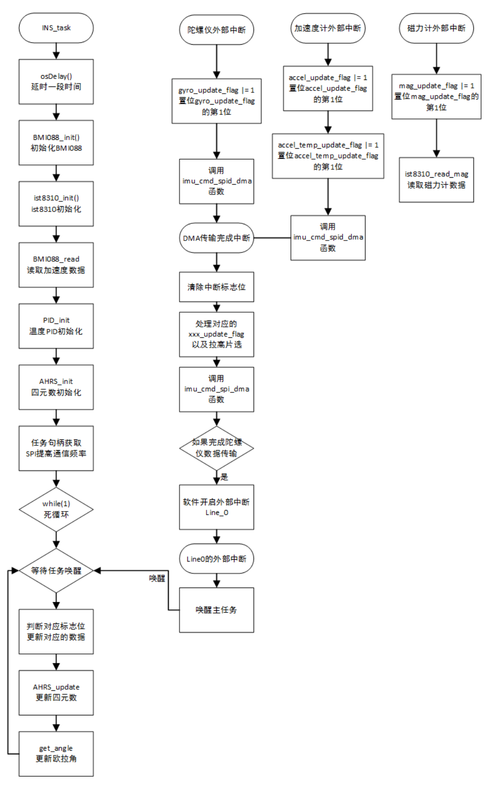

## 第4章 四轮巡视探测机器人导航系统设计


### 4.1 引言

在之前的章节中我已经介绍了机器人的硬件设计方案和嵌入式软件控制方案，可以实现机器人的底盘运动和云台的自稳控制等功能，在本节中我将讲述机器人的导航算法，这是实现机器人在未知区域探索的重要算法，而这些算法都是基于ROS操作系统的，因此要想实现这些算法需要在ROS下进行开发。

### 4.2 Dijstra算法分析

在路径规划的研究场景中已经存在了很多经典算法，路径规划最常见的五种基础算法为：`Dijkstra`,`Astar`(A*),`PRM`(Probabilistic Road Maps),`RRT`(Rapidly Exploring Random Tress),`人工势场法`(Artificial Fields).

说道路径规划就不得不说一下重要的数据结构“图”(Graph)，“图”是一种描述对象和对象之间的数学方法，如下图所示，这是一个具有７个节点(node)的无向图，节点和节点之间的连线称为边(edge)，每条边都具备一定的权重,“图”在路径规划中是一个十分重要的数学工具.


由于这样子更加直观，所以通常我们都会使用图来讲解路径规划的算法原理。从贴合直觉的角度来描述图的话，举个例子：A，B，C，D，E，F，G分别是7个城镇，城镇和城镇之间有些铺设了高速公路，有些则没有，这就是“边”。假设我们现在要找出从城镇A到城镇G之间路程最短的路线，而每段高速公路的路程都可能不一样，那么我们就**把路程看为权重或者说是代价（cost）**，很明显我们就是要**找出一条总代价（总权重）最小的路线**。再假设，我们现在不想找最短路线了，我想找最经济的路线（路费最低），那么我们就会将费用视为代价，并尝试找出总代价最低的路线。

#### 4.2.1 Dijkstra算法原理

如下图所示：假设起点是A，终点是G，每条边具备不同的代价值，我们的任务就是**找出从A到G代价最小的路径**。每个节点还具备两个属性值，一个是node_cost，这个**node_cost记录了当前节点到起点的已知的最小总代价值**，这个node_cost会在算法迭代过程中由于规划出来的路径不相同而被更新成不同的值。另一个属性值是parent，**parent表明了根据当下规划出来的路径**，该节点对应的父节点，比如说：节点F的父节点可能是B也可能是D也可能是E，在完全取决于我们选择哪条路径。

在示意图中圆圈中的“C，1，A”表示：该节点是C，按照当前规划的路径，C节点的父节点是A，且C节点到起点的代价值为1。

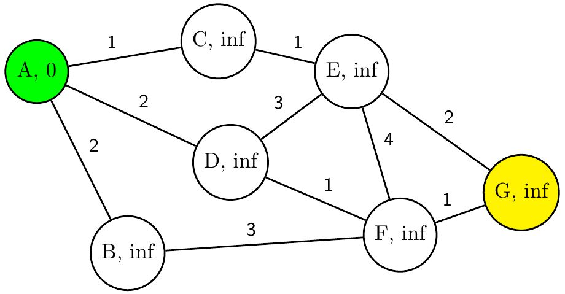

为方便起见，我用绿色代表起点，黄色代表终点，红色代表已经完成遍历，蓝色节点表明节点尚未完成遍历，白色代表未纳入考虑范围之内。在`Dijstra `算法开始之前，我们将起点的*node_cost*设为０，其余节点的*node_cost*设为无穷(infinite)，所有节点的parent均设置为空。未完成列表里只有起点，已完成列表为空。

`Dijstra`是一个迭代的过程，在每轮迭代的开始，需要找出未完成遍历列表中的所有节点中的*node_cost*最小的那个节点并设置*current_node*,并将这个被选中的current_node移除未完成列表，设置为已完成遍历。每轮迭代中，都会对*current_node*的所有**未完成遍历的**相邻节点进行单独的判断，判断相邻节点当前的*node_cost*s是否大于*current_node*的*node_cost*与连接边的代价值之和。如果大于的话，将相邻节点的node_cost更新为current_node的node_cost加上连接边的代价值，并且将相邻节点的parent更新为current_node，如果这个相邻节点尚未被加入未完成列表，则将其添加进列表中。如果小于的话，则保持原样，不执行任何操作。

例如：在**第一轮迭代**开始时，由于A是node_cost最小的节点，所以A被设置为current_node，并被标记为已完成遍历，接着我们会从A开始进行第一轮搜索，我们可以看到与A相邻的节点分别有B，C，D。对于A的相邻节点B来说，当前B的node_cost = inf，A的node_cost = 0，连接边的cost = 2。很明显B.node_cost > A.node_cost + edge.cost，那么我们就将B的node_cost更新为2，B的parent更新为A。同样的道理，对其余两个相邻节点进行判定。结果如下图所示。

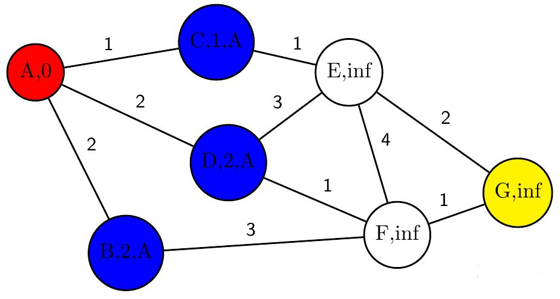

那么**第二轮迭代**我们在未完成列表中寻找具备最小node_cost的节点，很明显最小的是节点C，将C移出未完成列表后，我们就对C的相邻节点进行单独判定。完成判定后结果如下：

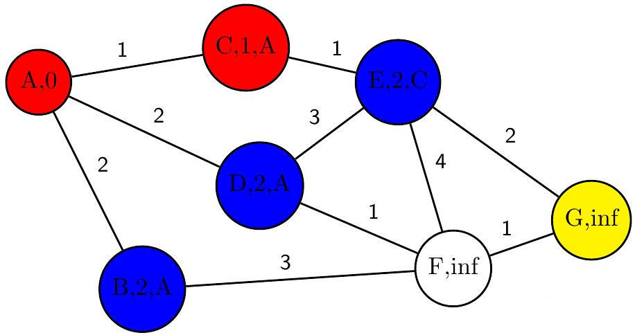

以此类推，第三轮迭代选择B为current_node，则的结果为：

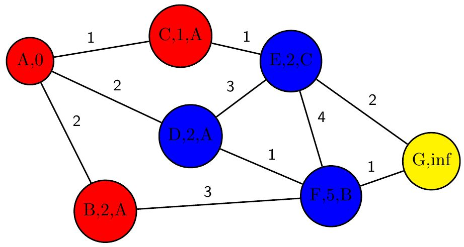

**第三轮迭代**选择D为current_node，则的结果如下，注意到F的node_cost被更新为3，这就意味着找到了一条从起点A到达F花费代价更低的路径，这便是`Dijstra`算法的精髓所在——每次迭代都在产生规划出代价更低的路径。

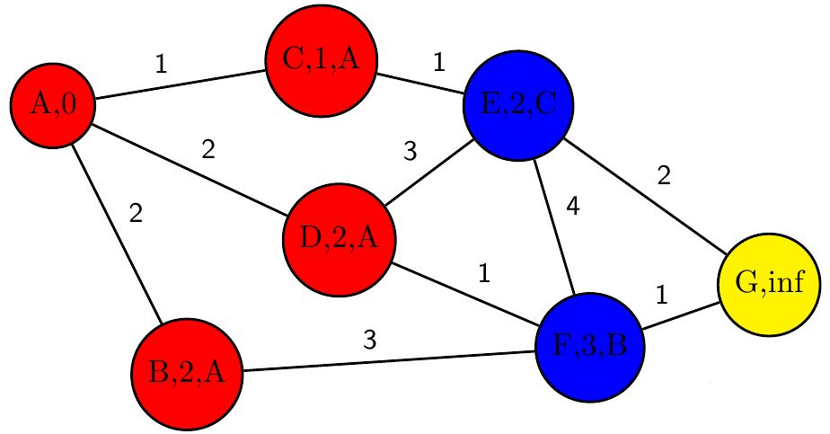

在**第四次迭代**中，毫无悬念地选择了E作为current_node，我们发现G是E的相邻节点，那么恭喜，我们成功找到了A到G的路径。

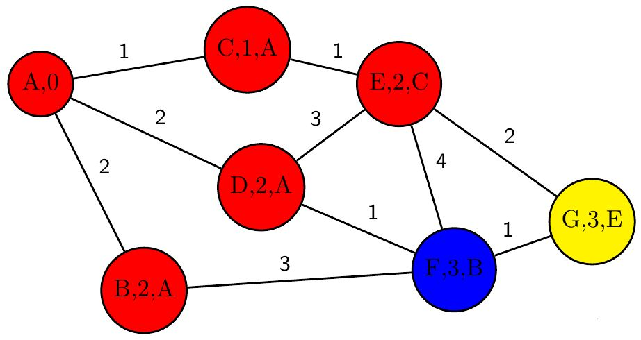

当我们完成规划以后该如何根据规划结果找到那条最短路径呢？这时我们之前一直没有发挥作用的属性值parent就要大显神威了，我们从终点开始，根据当前节点的parent值一个一个往回走就能回到起点了。这也就把路径描绘出来了。

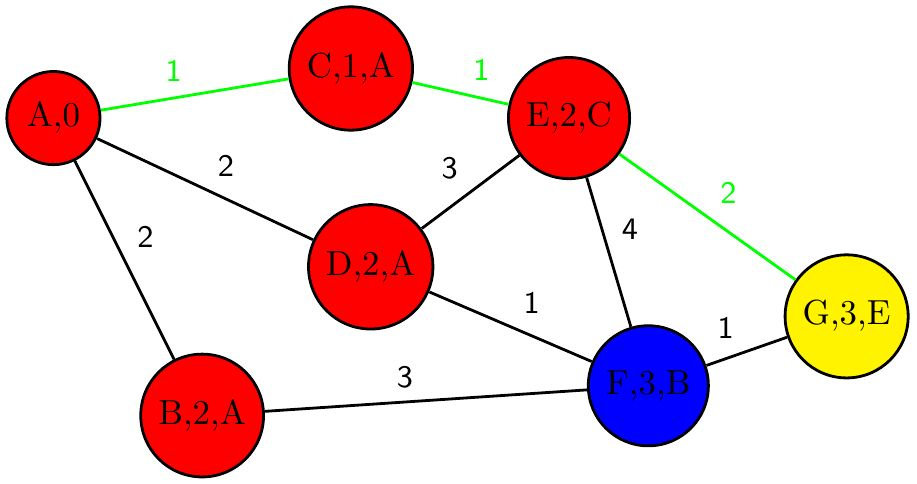

#### 4.2.2 Dijstra算法流程

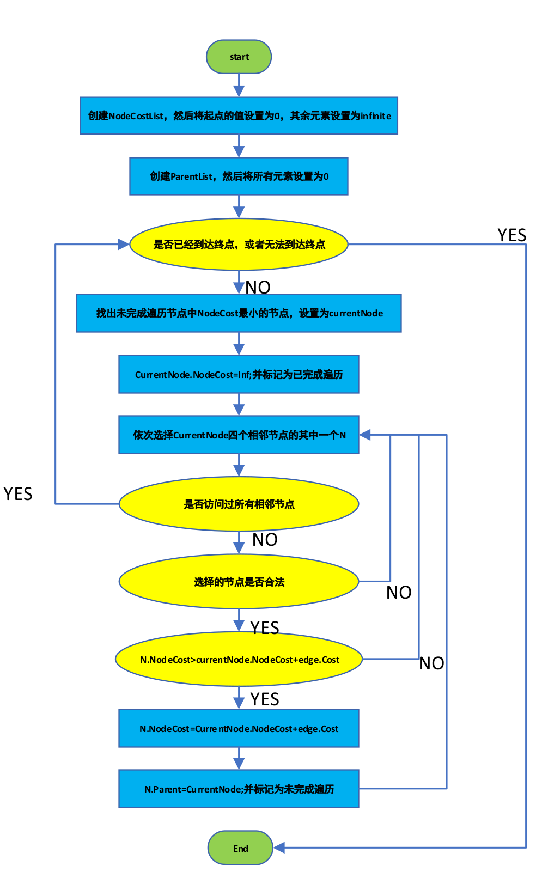

核心代码如下所示：

```matlab
while true
  [min_node_cost, current_node_index] = min(node_cost_list(:));
  if(min_node_cost == inf || current_node_index == destination_index)
    plan_succeeded = true;
    break;
    end
    node_cost_list(current_node_index) = inf;
    map(current_node_index) = Finished;
  [x,y] = ind2sub(MapSize, current_node_index);
    for k = 0:3  % four direction
    if(k == 0)
        adjacent_node = [x-1,y];
    elseif (k == 1)
      adjacent_node = [x+1,y];
    elseif (k == 2)
      adjacent_node = [x,y-1];
    elseif(k == 3)
      adjacent_node = [x,y+1];
    end
    
    if((adjacent_node(1) > 0 && adjacent_node(1) <= MapSize(1)) && (adjacent_node(2) > 0 && adjacent_node(2) <= MapSize(2))) % make sure the adjacent_node don't exceeds the map
            if(map(adjacent_node(1),adjacent_node(2)) ~= Obstacle && map(adjacent_node(1),adjacent_node(2)) ~= Finished)
                if(node_cost_list(adjacent_node(1),adjacent_node(2)) > min_node_cost + 1)
                    node_cost_list(adjacent_node(1),adjacent_node(2)) = min_node_cost + 1;
                    if(map(adjacent_node(1),adjacent_node(2)) == Origin)
                        parent_list(adjacent_node(1),adjacent_node(2)) = 0;  % Set the parent 0 if adjacent_node is the origin.
                    else
                        parent_list(adjacent_node(1),adjacent_node(2)) = current_node_index; % Set the parent current_node_index
                    end
                    map(adjacent_node(1),adjacent_node(2)) = Unfinished; % Mark the adjacent_node as unfinished
                end
            end
        end
  end
end
```

最终的演示效果如下图所示：
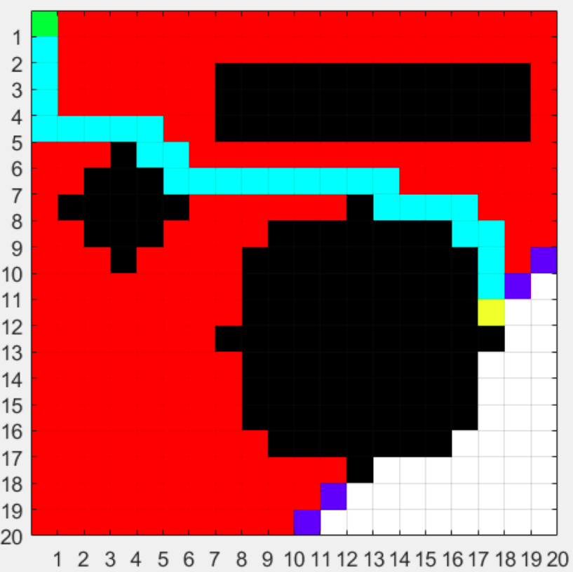


### 4.3 DWA局部路径规划算法分析

DWA(Dynamic Window Approach)算法,即动态窗口法,它是机器人进行局部路径规划的一种重要算法,在 1997 年由 D.Fox,W.Buegrad,S.Thrun 等人提出。在 ROS 中主要采用的是 DWA 算法。
DWA 算法的主要思路是:

* 在速度空间$(v,w)$中对线速度 和角速度 进行多次采样,获得多组值;

* 模拟计算机器人在这样的速度条件下一段时间的机器人的运动轨迹;

* 引入评价函数,使用评价函数对模拟预测的多组轨迹进行评价,并且选取最优轨迹所对应的速度条件,使用它来控制机器人的运动。

DWA 算法的突出优点在于其动态窗口,它能够根据机器人驱动机构的加减速性能把速度采样空间限定在一个可行的动态的范围内。

#### 4.3.1 DWA算法原理

在DWA算法中，需要模拟机器人你的轨迹，因此我们需要知道机器人的运动学模型，我们假设移动机器人的轨迹是一段一段的圆弧或者直线，同时我们认为机器人不是全向移动，即不能纵向移动，只能前进和旋转($v_t,w_t$),当进行机器人的轨迹计算时，需要考虑两个相邻时刻。为简单起见，同时由于机器人相邻时刻(一般骂盘采样周期在ms以内)机器人的运动距离较短，可以将相邻点之间的运动轨迹看成直线，即沿机器人坐标系x轴移动了 $v_t*\Delta{t}$。只需将该段距离分别投影在世界坐标系x轴和y轴上就能得到t+1时刻相对于t时刻机器人在世界坐标系中坐标移动的位移 $\Delta{x}$和 $\Delta{y}$:
$$
\Delta{x}=v\Delta{t}\cos(\theta_t)\tag{4-1}\label{}
$$

$$
\Delta{y}=v\Delta{t}\sin(\theta_t)\tag{4-2}\label{}
$$

以此类推，如果项推算一段时间内的轨迹，只需要将这段时间的位移增量累计求：
$$
x=x+v\Delta{t}\cos(\theta_t)\tag{4-3}\label{}
$$

$$
y=y+v\Delta{t}\sin(\theta_t)\tag{4-4}\label{}
$$

$$
\theta_t=\theta_t+w\Delta{t}\tag{4-5}\label{}
$$

接下来根据速度就可以推算出轨迹，然后评价轨迹好不好。

 **速度采样**是DWA的第二个核心：在速度 ($v,w$)的二维空间中，存在无穷多组速度。但根据机器人本身的限制和环境限制可以将采样速度控制在一定范围内：

1.移动机器人受自身最大速度最小速度的限制：
$$
v_m=\{v\epsilon[v_{min},v_{max}],w\epsilon[w_{min},w_{max}]\}\tag{4-6}\label{}
$$
2.移动机器人受电机性能的影响，由于电机力矩有限，存在最大加速度的限制，因此移动机器人轨迹前向模拟的周期sim_period内，存在一个动态窗口，在窗口内的速度是移动机器人实际大到的速度
$$
v_d=\{(v,w)|v\epsilon[v_c-\dot{v_b}\Delta{t},v_c+\dot{v_a}\Delta{t}],w\epsilon[w_c-\dot{w_b}\Delta{t},w_c+\dot{w_a}\Delta{t}]\}\tag{4-7}\label{}
$$
其中 $v_c,w_C$是机器人的当前速度。

3.基于移动机器人的安全考量：为了在撞到障碍物之前停下来，需要在最大的减速条件下，速度有一定范围：
$$
v_a=\{(v,w)|v\le\sqrt{2\cdot dist(v,w)\cdot \dot{v_b}},w\le \sqrt{2\cdot dist(v,w)\cdot \dot{w_b}}\}\tag{4-8}\label{}
$$
其中dist(v,w)为速度(v,w)对应轨迹上离障碍物最近的距离。当然这个条件并不是在采样一开始就能够得到的。需要我们模拟出来机器人的轨迹以后，找到障碍物位置，计算障碍物与机器人的距离，然后看当前采样的这对速度能否在碰到障碍物之前停下来，如果能，那么这对速度可以接受，否则这对速度就得抛弃。同时应注意：为了简化每组速度对应轨迹的计算，该算法假设机器人在往前模拟轨迹的这段时间(sim_period)内速度不变，知道下一时刻采样给定新的速度命令。动态窗口采样轨迹如下图所示:

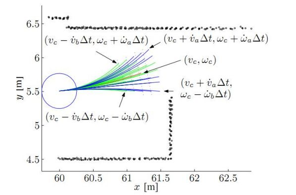

**评价函数**：在采样的速度组中，有若干组轨迹是可行的，因此需要用评价函数对每条轨迹进行评价，DWA采用的评价函数如下：
$$
G(v,w)=\delta(\alpha\cdot heading(v,w)+\beta\cdot dist(v,w)+\gamma\cdot velocity(v,w))\tag{4-9}\label{}
$$

* 方向角评价函数，heading(v,w)是用来评价机器人在当前设定的采样速度下，达到模拟轨迹末端时的朝向和目标之间的角度差距，如下图所示：

  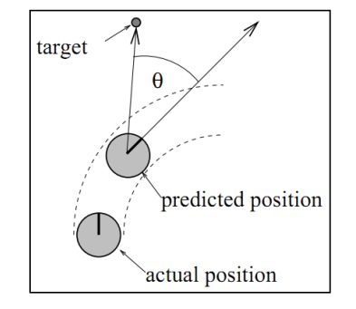

  $\theta$越小，评价得分越高

* dist(v,w)代表机器人在当前轨迹上与最近的障碍物之间的距离。如果在这条轨迹上没有障碍物，则将其设定一个常数

* velocitty(v,w)用来评价当前轨迹的速度大小。

* 平滑处理，上面三部分计算出来后不能直接相加，需要对每一部分进行归一化再相加，每一项除以每一项的总和：
  $$
  normal_head(i)=\frac{head(i)}{\sum_{i=1}^{n}head(i)}\tag{4-10}\label{}
  $$

  $$
  normal_dist(i)=\frac{dist(i)}{\sum_{i=1}^{n}dist(i)}\tag{4-11}\label{}
  $$

  $$
  1normal_velocity(i)=\frac{velocity(i)}{\sum_{i=1}^{n}velocity(i)}\tag{4-12}\label{}
  $$

  其中，n为采样的所有轨迹，i为待评价的当前轨迹.

## 第5章 总结与展望

### 5.1 总结

移动机器人的技术发展已经越来越成熟，且在灾害救援中起到了至关重要的作用，它能够代替搜救队员提前进入灾难现场获取情报信息，并实施救援行动。本文从机器人的硬件，软件和算法层面设计了四轮救援机器人的控制系统，并结合ROS框架，基本完成了SLAM功能。

本文主要的工作和创新性如下：

（１）本文对移动机器人的硬件结构进行了选型和分析

（２）对移动机器人控制系统进行了硬件设计，对移动机器人进行了运动学建模。机器人的控制器采用上，下位机分层结构，上位机为妙算和远程PC，主要负责运动规划，图像处理等任务，下位机采用Robomaster A板来控制底盘和云台的电机运动，负责机器人的基本控制任务，妙算与底盘通过usb进行通信，远程PC与妙算通过TCP进行通信，实现数据和图像的传输。

（３）对移动机器人控制系统进行了软件设计，在底层嵌入式环境下，采用CAN通讯实现了电机与控制板之间的通讯与控制任务，使用串级PID对云台的角度环和角速度环进行双环控制，以实现云台自稳功能，使用mahony算法对IMU进行了姿态解算，在Linux环境下，结合ROS的分布式，松耦合等特点，采用ROS机器人操作系统作为软件框架，来实现机器人的导航，为了便于实时观测相关传感器的信息，使用rviz来进行可视化操作。

### 5.2 展望

在嵌入式端，本次毕业设计实现了机器人的基本运动控制和云台控制，在linux端，实现了基本的路径规划算法，可以让机器人在陌生环境下进行基本的导航和壁障，但目前来说，想要实现导航任务，操作人员需要会在linux下进行命令行操作，需要一定的学习成本。所以在接下来的时间里，我将继续完善这次毕业设计，让该机器人可以实现更多的功能，例如语音对话，人脸识别。

## 参考文献

[1]  谭明，王硕.机器人技术研究进展[J].自动化学报，2013.39(7):963-972.

[2]  高翔，张涛.视觉SLAM十四讲[M]，电子工业出版社，2017.

[3]  张鹏 .基于ROS的全向移动机器人系统设计与实现[D].中国科技大学，2017.

[4]  朱磊磊，陈军.轮式移动机器人研究综述[J].机床与液压,2009,37(8):247-247.

[5]  王友权.自主导航的农用轮式移动平台设计与路径跟踪控制[D].南京农业大学，2008.

[6]  彭天然.物料搬运移动机器人机械与控制系统设计与研究[D].合肥工业大学，2016.


## 致谢

转眼间，大学本科四年即将结束。回顾这四年时间，我从刚入校什么都不会的小白成长为了一位合格的机器人工程师，一路走来，除了自己个人的不断学习，背后却是受到了各位老师和同学的全力支持。

​	我非常感谢我的父母能提供物力与精神力支持我完成大学学业。在课堂上，我感谢我的班导赵迪老师对我学习上的指导。在技术研究方面，由衷的感谢丁善婷老师，汪威老师等给我在课余时间进行竞赛研究的物资支持与理论指导。感谢大学里教学过我专业知识的所有老师以及我的课题指导老师。最后感谢实验室的同学们与我共同度过了最后的大学生涯，让我沉下心来专研技术，心无旁骛的完成了大学最后的作品。


