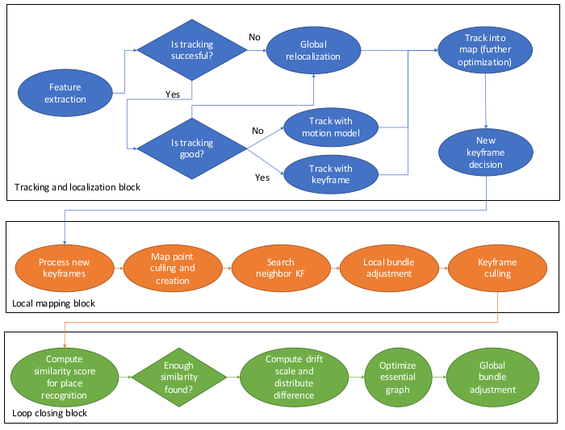
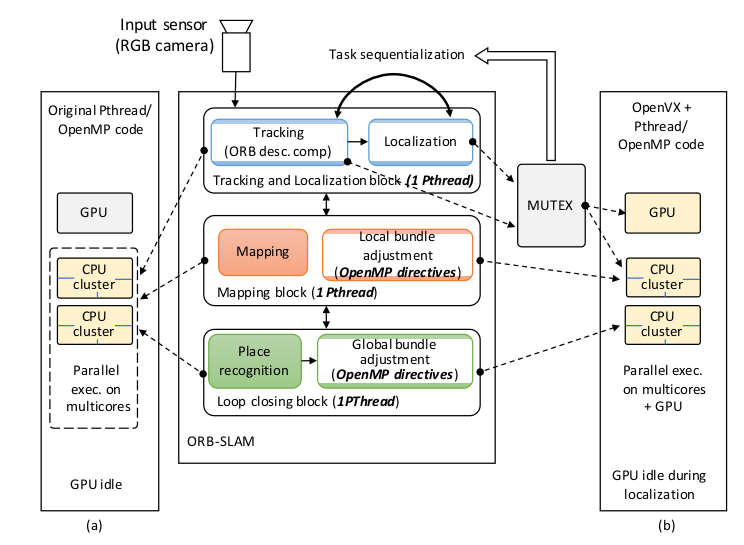
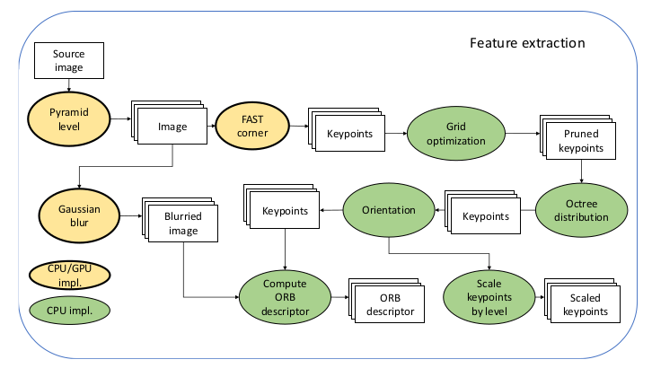
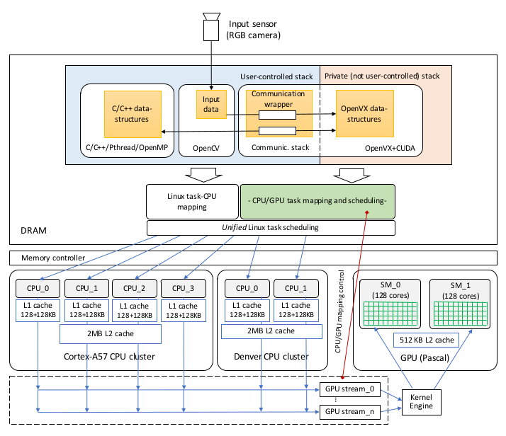
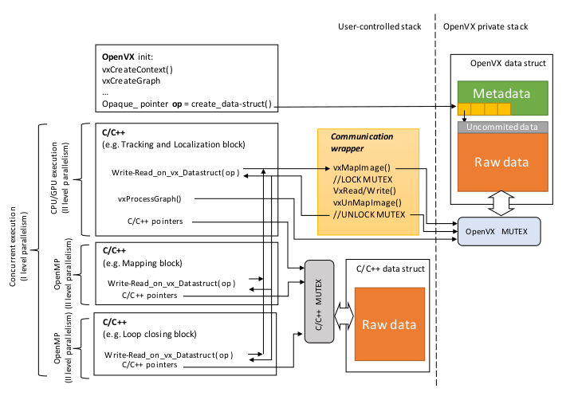
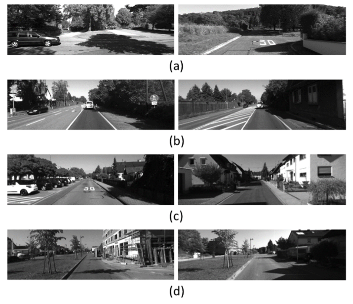
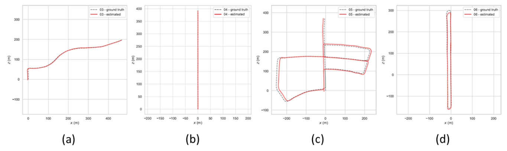
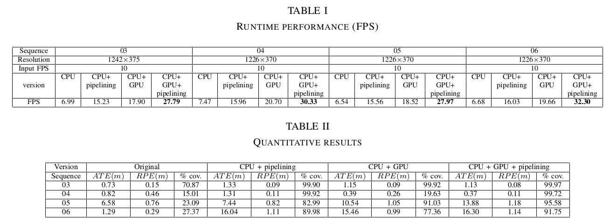

># 嵌入式GPU板上实时的数据流ORB-SLAM

**作者: Stefano Aldegheri,Nicola Bombieri,Domenico D.Bloisi,and Alessandeo Farinelli**

**来源:2019 international Conference on Intelligent Robots and Sysstems(IROS)**
## 摘要
得益于市场上配备GPU的低成本嵌入式板的可用性,包括无人驾驶飞机和地面车辆在内的机器人在嵌入式板上的使用正在增加.由于硬件限制,移植在台式机CPU设计的算法至嵌入式板上并不简单.在本文中,我们介绍了如何修改和自定义开源SLAM算法ORB-SLAM2,以便在NVIDIA Jetson TX2上实时运行.我们采取数据流范式来处理图像,从而获取有效的CPU/GPU负载分配,从而获取每秒约30帧的处理速度.在KITTI数据集的四个不同序列上的定量实验结果证明了该方法的有效性.我们的数据流ORB-SLAM2算法的源代码可在github上公开获得.

![Fig.1. (a)NVIDIA Jetson TX2 module.(b)The KITTI dataset[5]](doc/1.png)
* `图1.(a) NVIDIA Jetson TX2 module. (b) The KITTI dataset [5]`

## 1.介绍
导航时自主移动机器人的主要目标.为了从当前位置A移动到所需目的地B,移动机器人需要地图,以来了解其在地图上的位置,并规划从A到B的路径,可能会从一系列的可能路径中选择最适合的.同步定位与建图(SLAM)旨在处理来自机器人传感器的数据,以建立位置操作环境的地图,并同时在地图上定位传感器(同时获取移动传感器的轨迹)

许多不同类型的传感器可以被集成到SLAM算法中,例如激光测距传感器,编码器,惯性单元,GPS和照相机.近年来,仅使用相机的SLAM受到了积极的讨论,因为相对其他传感器而言相机相对便宜,并且它们的配置仅需要最小的传感器设置[1].当SLAM的输入仅为视觉信息时,该技术被称为视觉SLAM(vSLAM)

vSLAM算法可以根据三类进行分组,即基于特征的方法,直接法和RGB-D方法.在基于特征的方法中,通过从输入图像中提取一组特征观测值并通过仅根据这些特征观测值计算相机位置和场景几何来估算图像中的几何信息[2].直接(或无特征)方法旨在直接根据图像强度优化几何形状,并在整个图像上使用光度一致性作为误差测量.在RGB-D SLAM中,稠密深度可以检测出没有纹理的平面[3].

vSLAM的主要挑战之一是实现实时处理.Direct和RGB-D方法对计算机的要求很高,并且需要GPU计算才能实现实时运算.目前ORB-SLAM2[4]时最完整的基于功能的vSLAM系统[1].它可以在标准CPU上实时工作,但不能在嵌入式板上工作.

在本文中,我们介绍了ORB-SLAM2的改进版本,该版本可在NVIDIA Jetson TX2嵌入式板上实时运行(见图一).根据[6],ORB-SLAM是在最流行的稀疏方法中提供了最佳准确性的软件包.但是,就CPU和内存使用而言,这是一个要求很高的算法[7],因此需要精心的计算负载分配才能获得具有硬件限制的实时性能.

这项工作的贡献时三方面的:

**1) 我们使用数据流范式以图形形式获得原始算法的表达形式,从而可以有效地细分CPU和GPU之间的计算负荷**

**2) 实验结果表明,通过平衡CPU/GPU的使用,可以在保持良好准确性的同时在KITTI数据集的四个不同序列上实现实时性能**

**3) 我们在[GitHub](https://github.com/xaldyz/dataflow-orbslam)上提供了针对NVIDIA Jetson TX2实时使用而优化的完整源代码**

在本文的其余结构如下.相关工作在第二节中讨论.第三部分介绍了所提供的方法.实验评估见第四节.最后,在第五节中得出结论.

## 2.研究背景和相关工作
ORB-SLAM2[4]是一种SLAM系统,可以处理来自单目,立体和RGB-D摄像机的数据.该系统由以下三个主要模块组成(参见图2)

* `图2. ORB-SLAM2算法的主要模块`

**`跟踪和本地化`** 该模块负责计算视觉特征，在环境中给机器人进行定位，并且在已经保存的地图和输入流之间存在显着差异的情况下，将更新的地图信息传递给映射模块。整个系统可以计算的每秒帧数（FPS）很大程度上取决于此块的性能。

**`建图`** 它通过使用本地化模块发送的信息（地图更改）来更新环境地图。它是一个计算耗时的模块，其执行速度严格取决于代理速度。但是，考虑到这项工作中分析的KITTI数据集的实际代理速度[5]，它并不代表系统瓶颈。

**`闭环`** 它旨在调整输入分析期间累积的刻度漂移误差。当检测到机器人路径中的环路时，该模块将通过高延迟的大量计算来更新映射的信息，在此期间，前两个块将被挂起。这可能导致机器人失去跟踪和定位信息，作为代价，机器人会暂时丢失。该模块的计算效率（按需运行）对于最终结果的质量至关重要。

该系统由三个并行线程组成，每个块一个。使用并行线程可以在具有16GB RAM的Intel Core i7台式机上获得实时处理[4]。

该系统由三个并行线程组成，每个块一个。使用并行线程可以在具有16GB RAM的Intel Core i7台式机上获得实时处理[4]。

[NVIDIA Jetson TX2](https://www.nvidia.com/en-us/autonomous-machines/embedded-systems-dev-kits-modules/?section=jetsonTX2) 嵌入式板是安装在具有双核NVIDIA Denver2加上四核ARM Cortex-A57、8GB RAM和集成256核Pascal GPU的研究车辆上的理想平台。 SLAM算法几乎没有能够在嵌入式板上实时运行的示例：Abouzahir等[8]提出了在不同的嵌入式体系结构（即iMX6，panda ES，XU4和TX1）下四种不同的SLAM算法（即Monocular FastSLAM2.0，ORB-SLAM，RatSLAM和线性SLAM）的处理时间的研究，发现所有考虑的SLAM算法都无法在那些体系结构上实现实时性能。 Nguyen等[9]报告ORB-SLAM在NVIDIA Jetson TX1嵌入式平台上每帧花费190毫秒。而且，诸如Raspberry或Odroid之类的低成本嵌入式板的功能不足以运行ORB-SLAM2。例如，Nitsche等[10]无法在Odroid XU4上运行ORB-SLAM2，由于每帧的处理时间较长,因此跟踪很容易就会丢失.

除了在嵌入式板上运行SLAM之外，还可以在远程台式PC上执行计算并将结果发送到机械手的嵌入式板上。 Van Opdenbosch等人的工作就是一个例子[11]。他们提出了一种用于远程vSLAM的方法，其中在本地机器人上提取了本地二进制特征，将其压缩并通过网络发送到集中处理节点。但是，在缺乏可靠网络的情况下，远程vSLAM无法使用，这在现场部署中通常是这样。

Giubilato等[7]分析了在嵌入式板上实现SLAM系统的挑战，并强调指出，现有的大多数对SLAM系统的审查和分析都没有考虑到在嵌入式计算平台上实现的后果。特别是，他们在Jetson TX2上比较了ORB-SLAM2，SPTAM和RTAB-MAP的性能，发现ORB-SLAM2在挑战性场景中显示出强大的鲁棒性。但是，他们无法在TX2板上实时运行ORB-SLAM2。 Vempati等[12]描述了一种使用配备有Jetson TX2的无人机（UAV）进行自主喷涂的系统。他们使用基于深度的vSLAM方法以60 FPS的速度实现车载计算。但是，他们没有提供其方法与其他方法的比较，因此无法评估他们的方法是否可以用于不同于所考虑的喷漆用例的应用中。

在本文中，我们描述了一种优化CPU/GPU计算负载以实现TX2板上ORB-SLAM2实时性能的方法。尤其是，我们提供了一种使用ORB-SLAM2的异构（即CPU + GPU）实现方式来充分利用最新嵌入板的潜力的方法。

## 3.研究方法

我们是从[4]提出的的开源ORB-SLAM2算法为基础来进行嵌入式移植,ORB-SLAM2最初提供了两个级别的并行性,第一层由三个主要的算法块（见图2）给出，它们被实现为在共享内存多核CPU上作为并行PThreads运行。第二级由包调整子块的自动并行实现（即thorugh OpenMP指令）给出，它是局部映射块和循环关闭块的一部分。这允许在多核CPU上并行计算长时间的任务。在原始代码中，不考虑在GPU上并行执行任何块或子块（请参见图3a）。

* `图3.Jetson板上的ORB-SLAM应用程序和执行模型的局限性：（a）原始代码（不使用GPU），（b）OpenVX NVIDIA VisionWorks（跟踪和本地化任务的顺序化，并且不进行pipelining）。`

为了充分利用目标板的异构特性（即多核CPU与多核GPU结合在一起），我们增加了两个并行级别。首先由一组跟踪子块的GPU并行实现给出（见图4）。第二个是通过实现此类子块的8级流水线来实现的。我们专注于特征提取模块，因为对于这项工作中分析的数据集（即KITTI [5]），这是根据支持的FPS表征处理速率的最重要瓶颈。

* `图4.特征提取模块和相应子模块实现（GPU与CPU）的DAG。`

为此，我们首先采用如图4所示的OpenVX标准，将特征提取模块的模型重新设计为直接非循环图（DAG）。原始实现的转换最初是为CPU设计的。仅在CPU / GPU并行执行中，需要控制CPU和GPU上运行的代码之间的通信。尤其是，映射阶段至关重要，需要成功实现算法各块之间的时间同步。

NVIDIA 提供了VisionWorks,它通过有效实现嵌入式视觉内核和针对CUDA的GPU进行了优化的运行系统,扩展了OpenVX标准,不过,例如一个工具包有一些限制,不允许目标多级运行.特别是，管理DAG子块之间的同步和执行顺序的VisionWorks运行时系统，隐式地对跟踪和本地化块的执行进行了排序（请参见图3b）。这是由于以下事实：只有跟踪子块可以建模为DAG，并且尽管系统的其余部分可以集成为C / C ++ / OpenCV代码，但它们的通信和同步是通过基于互斥体的机制解决的（参见图3）。每当定位块运行时，这样的序列化都会导致GPU处于空闲状态。此外，VisionWorks不支持DAG子块之间的流水线执行。

由于VisionWorks不是开放源代码，因此我们重新实现了开放源代码，使之成为针对多级并行性的高级运行时系统，并为Jetson TX2开发板提供了符合OpenVX的加速计算机视觉原语库（请参阅第4节以获取有关代码的信息在GitHub上）。

### *A.ORB-SLAM的异构实现*

图5显示了映射到Jetson TX2架构中的建议的软件方法的概述。为了充分利用TX2板的潜力，我们结合了不同的语言和并行编程环境。特别是，我们在C/C++中实现了控制部分，在CPU内核上通过Pthreads实现了并发块，在OpenMP中实现了具有并行化指令的代码块，在CUDA中实现了GPU计算的内核，同时在OpenVX中实现了基于数据流例程的基于原始的并行化。我们采用OpenCV通过标准数据结构和API实施I/O通信协议。这使开发的ORB-SLAM应用程序可移植，并易于插入使用OpenCV的任何其他应用程序中。

 

* `图5.系统架构：使用NVIDIA Jetson TX2板上的建议方法开发的嵌入式视觉应用程序的内存堆栈，任务映射和任务调度层。`

Jetson TX2开发板是一种共享内存架构，将两个CPU集群与两个对称GPU多处理器结合在一起。 CPU和GPU共享一个统一的内存空间。
每个软件模块并发执行所涉及的堆栈层包括两个主要部分：
* `用户控制堆栈`,这是一个可编程堆栈,它允许在不同的CPU上运行的进程(例如C/C++进程,OpenCV API,Pthread和OpenMP进程)通过共享内存进行通信.
* `专用堆栈`,它由OpenVX运行时系统生成和管理，而不是由用户编程，并且允许在不同CPU或GPU上运行的OpenVX图形节点之间进行通信。

图5的顶部显示了我们体系结构中用户控制的堆栈和私有堆栈。

在NVIDIA Jetson上本地运行的Linux Ubuntu操作系统将与用户控制的堆栈相关的任务映射到CPU内核。提及的运行时系统将OpenVX任务映射到CPU内核或GPU多处理器。这两个部分被关联到一个统一的调度引擎中，以便：
* 1)启用两个部分的完全并发
* 2)避免对两组任务进行序列化
* 3)避免同步开销

这样，操作系统可以调度所有映射到（两个堆栈部分的）CPU核心的任务，而OpenVX运行时系统可以控制GPU任务调度，CPU到GPU的通信以及CPU到GPU同步（即GPU流和内核引擎）。为此，我们开发了基于C/C++-OpenVX模板的通信包装器，该包装器允许对私有堆栈上的OpenVX数据结构进行内存访问，并可以完全控制C/C++环境对OpenVX上下文的执行。

* `图7.通信包装程序及其在系统中的集成`

图6显示了包装器及其在系统中的集成。 OpenVX初始化阶段生成图形上下文并分配私有数据结构。这种分配将不透明的指针返回到分配的存储器段，即指向私有内存区域的指针,程序员不知道该区域的布局

已定义OpenVX读写原语（在图6中的`Write-Read_on_vx_Datastructure()`）通过不透明指针访问私有数据结构。这些原语是从C/C++上下文中调用的，并通过通信包装API设置了互斥机制，以安全地访问OpenVX数据结构。与OpenVX运行时系统共享相同的互斥锁，以进行整个图形处理（图6中的`vxProcessGraph（）`）。因此，该机制可确保在多核上同时运行时，在访问OpenVX和C/C++上下文之间的共享数据结构期间实现同步。值得注意的是，在C / C ++环境中执行的整个图形过程的调用开始执行面向数据流的OpenVX代码。如图6所示，这样的调用可以由不同的C / C ++线程同时执行，并且每次调用都涉及到对应图实例的映射和调度。推荐的通信包装和互斥系统允许在不同的并发OpenVX图形执行和C / C ++调用环境之间进行同步。访问共享数据结构时，采用标准互斥机制可同步属于用户控制堆栈的所有其他基于C / C ++的上下文。总之，所提出的基于互斥锁的通信包装程序允许应用程序的多级并行执行。特别是，对于子块之间流水线执行中的同步以及不同级别并行性的同时应用，这至关重要。

## 4.实验结果
为了评估我们修改版的ORBSLAM2的结果，我们使用了KITTI数据集中的四个序列（参见图7），如Mur-Artal和Tardos的原始论文所述[4]。

* `图7.来自KITTI数据集的四个序列的样本用于评估。 （a）序列03.（b）序列04.（c）序列05.（d）序列06。`

KITTI数据集[5]包含以10FPS记录的来自市区和高速公路上的汽车的分辨率为1242x375的图像序列(如图7),我们考虑四个序列，即03、04、05、06。序列03和04不包含循环，而序列05和06包含不同数量的循环。公开的地面实况可用于所考虑的序列。我们实现并评估了ORB-SLAM2的三个不同版本，其中跟踪模块利用了这些版本（请参阅第3-A节）：
* 1) CPU + pipelining
* 2) CPU + GPU
* 3) CPU + GPU + pipelining

### *A.运行时的性能*

表I显示了原始[ORB-SLAM2代码](https://github.com/raulmur/ORB_SLAM2)和我们在Jetson TX2板上运行的三个不同版本（在[GitHub]()上公开可用）的性能。使用相同的设置来比较不同版本，并重复执行每个序列五次，从而产生结果。

表I中的结果突出显示了原始代码和三种不同版本在支持的FPS方面所实现的不同性能.在这种嵌入式低功耗板上运行的原始代码不支持实时执行，平均只达到7FPS。pipelining和异构CPU + GPU执行都可以通过利用各种并行性来提高性能。由于采用了多级（组合）并行机制，因此CPU + GPU +pipelining版本可提供最佳结果。它支持帧速率高于25 FPS的实时执行。

### *B.定性定量评估与指标*
图8显示了我们最佳实现方式(即`CPU+GPU+pipelining`)的定性结果,为了节省空间,我们仅报告分析KITT学列的某些部分.

为了对结果质量进行定量评估，我们考虑了三个不同的指标：绝对平移的均方根误差（RMSE ATE），平均相对姿态误差（RMSE RPE）的均方根误差[13]和百分比重建的地图。使用ATE测量估计轨迹与地面真实轨迹之间的绝对距离，可以衡量估计轨迹的整体一致性。此外，ATE具有直观的可视化功能，可以方便地进行视觉检查（见图8）。 RPE度量允许我们评估SLAM系统的局部精度，即测量与两个连续姿势有关的误差[13]。从初始化步骤中计算出重建图的百分比。在重建地图的该部分上考虑了ATE和RPE

表II显示了定量结果.使用原代码实现，处理速度（大约7 FPS）无法满足数据集的10 FPS要求。结果，仅部分重建可用。由于仅针对地图的重构部分定义了度量，因此低地图覆盖率重构会导致非常低的（误导性）绝对误差。这种行为在ATE中更为明显，而RPE在所有版本中都是可比的。该分析强调了在28 FPS以上运行时，GPU的实现所提供结果的质量略有下降。这是由于特征提取原语相对于原始顺序版本的不同实现和同步所致。通常，通过兼顾性能和结果质量，CPU + GPU +pipelining实现可提供最高的FPS，其损失明显减少，并且对原始顺序执行的结果影响可忽略不计。

* `图8.在KITTI序列03（a），序列04（b），序列05（c）和序列06（d）的某些部分上对建议的ORB-SLAM应用程序版本CPU + GPU +管线进行定性评估。`

## 5.结论
Visual SLAM系统可以在商用台式PC上实现实时性能。但是，在嵌入式板上实时运行vSLAM方法需要修改原始代码，以充分利用最新配备GPU加速器的嵌入式板的潜力。在本文中，我们介绍了ORB-SLAM2算法的改进版本，该算法可以在NVIDIA Jetson TX2板上实现实时性能。在三个不同的公开可用数据集上进行的实验结果表明：
* 当在TX2嵌入式平台运行时我们所提及的代码比原始代码快4.5倍
* 修改后的版本的准确性与原始代码生成的结果相当

我们已经在GitHub上发布了系统的源代码，并提供了示例和说明，以便其他研究人员可以轻松使用。在将来的工作中，我们打算将Jetson TX2板安装在移动机器人上，以测试将ORB-SLAM2实现与其他用于导航任务的计算机视觉应用结合使用的情况。

## 感谢
 这项研究工作得到了意大利教育，大学与研究部（MIUR）和GNCS-INDAM（Nicola Bombieri）资助的“ 2018年Eccellenza分区计划2022”的部分支持。

 ## 参考文献
[1]  T. Taketomi, H. Uchiyama, and S. Ikeda, “Visual SLAM algorithms:a   survey   from   2010   to   2016,”IPSJ Transactions on ComputerVision and Applications,  vol.  9,  no.  1,  2017.  [Online].  Available:https://doi.org/10.1186/s41074-017-0027-2

[2]  J.  Engel,  T.  Sch ̈ops,  and  D.  Cremers,  “LSD-SLAM:  Large-scaledirect   monocular   SLAM,”   inComputer Vision – ECCV 2014,D.   Fleet,   T.   Pajdla,   B.   Schiele,   and   T.   Tuytelaars,   Eds.,   2014,pp. 834–849. [Online]. Available: https://link.springer.com/chapter/10.1007/978-3-319-10605-254

[3]  L. Ma, C. Kerl, J. Stckler, and D. Cremers, “CPA-SLAM: Consistentplane-model  alignment  for  direct  RGB-D  SLAM,”  in2016 IEEEInternational  Conference  on  Robotics  and  Automation  (ICRA),2016, pp. 1285–1291. [Online]. Available: https://ieeexplore.ieee.org/document/7487260

[4]  R.   Mur-Artal   and   J.   D.   Tard ́os,   “ORB-SLAM2:   an   open-sourceSLAM  system  for  monocular,  stereo  and  RGB-D  cameras,”IEEETransactions on Robotics,  vol.  33,  no.  5,  pp.  1255–1262,  2017.[Online]. Available: https://ieeexplore.ieee.org/document/7946260

[5]  A.  Geiger,  P.  Lenz,  and  R.  Urtasun,  “Are  we  ready  for  autonomousdriving? the kitti vision benchmark suite,” inConference on ComputerVision and Pattern Recognition (CVPR), 2012.

[6]  A. Quattrini Li, A. Coskun, S. M. Doherty, S. Ghasemlou, A. S. Jagtap,M. Modasshir, S. Rahman, A. Singh, M. Xanthidis, J. M. O’Kane, andI.  Rekleitis,  “Experimental  comparison  of  open  source  vision-basedstate  estimation  algorithms,”  in2016 International Symposium onExperimental Robotics,   2017,   pp.   775–786.   [Online].   Available:https://link.springer.com/chapter/10.1007/978-3-319-50115-467

[7]  R. Giubilato, S. Chiodini, M. Pertile, and S. Debei, “An experimentalcomparison   of   ros-compatible   stereo   visual   slam   methods   forplanetary   rovers,”   in2018 5th IEEE International Workshop onMetrology for AeroSpace (MetroAeroSpace),   2018,   pp.   386–391.[Online]. Available: https://ieeexplore.ieee.org/document/8453534

[8]  M.  Abouzahir,  A.  Elouardi,  R.  Latif,  S.  Bouaziz,  and  A.  Tajer,“Embedding   SLAM   algorithms:   Has   it   come   of   age?”Roboticsand  Autonomous  Systems,vol.100,pp.14–26,2018.[Online].  Available:  https://www.sciencedirect.com/science/article/pii/S0921889017301963

[9]  D.  Nguyen,  A.  Elouardi,  S.  A.  R.  Florez,  and  S.  Bouaziz,  “HOOFRSLAM   system:   An   embedded   vision   SLAM   algorithm   and   itshardware-software  mapping-based  intelligent  vehicles  applications,”IEEE Transactions on Intelligent Transportation Systems,  pp.  1–16,   2018.   [Online].   Available:   https://ieeexplore.ieee.org/abstract/document/8556398

[10]  M. A. Nitsche, G. I. Castro, T. Pire, T. Fischer, and P. D. Cristoforis,“Constrained-covisibility marginalization for efficient on-board stereoSLAM,”  in2017 European Conference on Mobile Robots (ECMR),2017, pp. 1–6. [Online]. Available: https://ieeexplore.ieee.org/abstract/document/8098655

[11]  D. V. Opdenbosch, M. Oelsch, A. Garcea, T. Aykut, and E. Steinbach,“Selection   and   compression   of   local   binary   features   for   remotevisual  slam,”  in2018 IEEE International Conference on Roboticsand Automation (ICRA),  2018,  pp.  7270–7277.  [Online].  Available:https://ieeexplore.ieee.org/document/8463202

[12]  A.   S.   Vempati,   I.   Gilitschenski,   J.   Nieto,   P.   Beardsley,   andR.  Siegwart,  “Onboard  real-time  dense  reconstruction  of  large-scaleenvironments  for  uav,”  in2017 IEEE/RSJ International Conferenceon Intelligent Robots and Systems (IROS),  2017,  pp.  3479–3486.[Online]. Available: https://ieeexplore.ieee.org/document/8206189

[13]  A.   Kasar,   “Benchmarking   and   comparing   popular   visual   SLAMalgorithms,”CoRR,  vol.  abs/1811.09895,  2018.  [Online].  Available:http://arxiv.org/abs/1811.09895